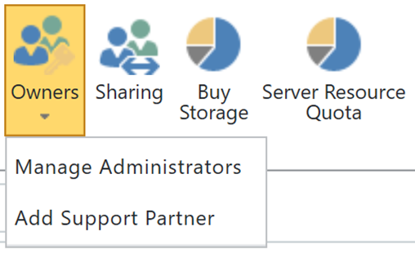

# 檢視或將管理員新增至您的 SharePoint Online 應用程式目錄View or Add an Administrator to your SharePoint Online App Catalog

若要可順利安裝 CLO365、 執行佈建解決方案的人員需要被列為租用戶應用程式目錄的管理員。To successfully install CLO365, the person doing the provisioning of the solution needs to be listed as an administrator of the tenant app catalog.

1. 從 Office 365 管理入口網站移至 SharePoint Online 系統管理中心From the Office 365 Administration portal go to the SharePoint Online Admin Center
1. **選取 [** 從網站集合清單應用程式目錄 URL **Select** the App Catalog URL from the site collection list 
1. 確認 CLO365 安裝程式已列為其中一個應用程式目錄管理員。Confirm that the CLO365 installer is listed as one of the app catalog administrators. 

如果您的使用者名稱會列出您可以返回佈建的自訂學習網站。 若未完成的下一個步驟。If your user name is listed you can return to provisioning the Custom Learning site.  If not complete the next steps. 

## 新增管理員Add an Administrator

1. 從 SharePoint 系統管理中心選取的應用程式目錄 URL 旁的核取方塊，並選取擁有者下拉式方塊。From the SharePoint Admin Center select the checkbox next to the app catalog URL and select the Owners drop-down box. 
1. 從下拉式清單功能表選取 [管理管理員Select Manage Administrators from the drop down menu 
1. 將正確的個別新增為網站集合管理員並按一下 [確定] 以儲存變更。Add the correct individual as a Site Collection Administrator and click OK to save your changes.

### 後續步驟-[網站佈建](installsitepackage.md)Next Steps - [Site Provisioning](installsitepackage.md)
