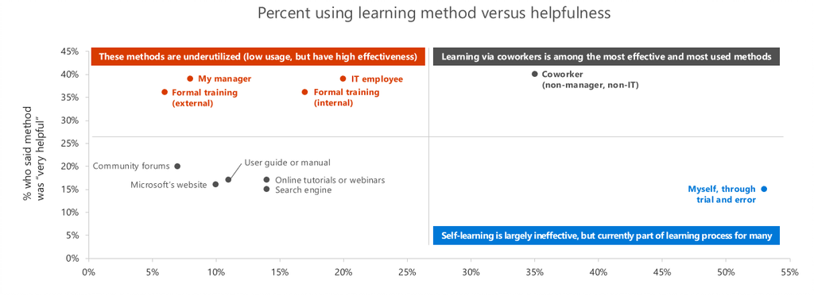

# 建立使用者採用冠軍 

組織變更管理功能的變更目標群組的人員行為的美工圖案。 沒有很大的科學和研究支援此做法。 這些文章中我們會協助您磁碟機將導致商務成果，公司中的主要服務採用。  下列最佳作法，我們將縮短您次若要從 Office 365 租用可測量值。  

冠軍程式是推動採用不可或缺的一部分。 在您的公司這些影響因數提供許多需要支援及鼓勵到已採用新技術的員工。 檢閱這些頁面，以建立您的採用計劃和執行精銳的程式取得通知。 

> [!NOTE]
> 您可以更新或取代這個播放清單資訊的相關參考的程式整個組織。

## 有冠軍以及何謂它們刻度？

冠軍不只需什麼它們，但是也會興奮，分享其知識和協助其了解更有效的解決方案的同事找到他們。 冠軍是使用現有工具通常迷惑和挫折熱心。 它們可協助您 win watercooler 紅挑戰 ！  

我們認為您務必獎勵冠軍有意義的方式。 一些建議如下：

- 若要參與員工績效考核精銳程式中允許成功的成員資格
- 確認使用的 Office swag 和員工份額報酬您最成功冠軍  
- 洽詢您冠軍持續的訓練與他們可以一起傳遞至其他員工的內容 

精銳特質不會不通常洽詢因為這些報酬，而因為它會建立它們可提供給員工滿意度更有意義和可測量的經驗。 

## 為什麼會冠軍重要？ 

透過同事學習是學習專業的環境中的最有效方法。 冠軍也會提供您採用程式有價值深入是什麼，關於您服務的部署、 訓練計畫和整體舉動有關您實作的變更無法正常運作。  

## 如何將冠軍支援您？

冠軍有助於減少的核心專案小組的資源造成負擔，並協助整個社群的磁碟機參與。 他們也會：

1. 建立 groundswell 成長的改良種工作採用熱誠
1. 建置影響轉變與其小組的圓形
1. 帶跨小組工作至生命週期的新方法
1. 識別業務挑戰及可能的解決方案
1. 提供意見反應給專案小組和贊助者
