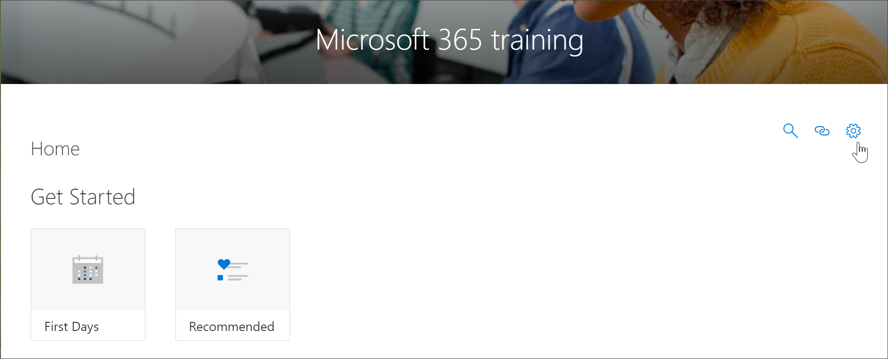

# 存取自訂學習管理] 頁面Access the Custom Learning Administration page

自訂學習管理 」 頁面是自訂學習網頁組件的權限管理集中控制點。自訂學習管理] 頁面上只有 SharePoint 管理員。以瀏覽網站的成員權限的使用者不會看到 [**管理播放清單**] 選項。此外，只有系統管理員必須能夠從 SharePoint**首頁**] 功能表項目開啟自訂學習管理] 頁面。The Custom Learning Administration page is the central controlling point for administration of the Custom Learning web part. The Custom Learning Administration page is only available to SharePoint Administrators. Users with member privileges visiting the site will not see the **Administer Playlist** option. In addition, only Administrators will have the ability to open the Custom Learning Administration page from the SharePoint **Home** menu item.  

> [!IMPORTANT]
> 在 [自訂學習管理頁面，例如隱藏項產品子類別或播放清單，所做的變更會反映在網頁組件中的所有執行個體。此外，其具有建議該只有一位管理員次由於如果多人同時使用自訂學習管理自訂學習不提供衝突偵測，自訂學習管理員] 頁面上進行的變更。Changes made on the Custom Learning Administration page, such as hiding a product subcategory or playlist, will be reflected in all instances of the Web part. In addition, it’s recommended that only one administrator at time make changes on the Custom Learning Administrator page, since Custom Learning does not provide collision detection if multiple people are using the Custom Learning Administration at the same time.  

## 從自訂學習網頁組件-慣用方法存取Access from the Custom Learning Web part - preferred method
當我們將為您示範在此範例中，開啟自訂學習管理] 頁面的網頁組件從就的慣用的方法由於新的瀏覽器視窗中開啟 [系統管理] 頁面。使用此方法之後，很容易檢查或修改您的工作索引標籤式頁面之間來回翻轉。As we'll show you in this example, opening the Custom Learning Administration page from the web part is the preferred method since it opens the Admin page in a new browser window. With this method, it's easy to flip back and forth between the tabbed pages to check or modify your work.  

1. 從 [自訂學習首頁上，按一下 [ **Office 365 訓練**並排顯示。From the Custom Learning Home page, click the **Office 365 training** tile.
2. 按一下 [**自訂學習系統**] 功能表，然後按一下 [**管理播放清單**。Click the **Custom Learning System** menu, then click **Administer Playlist**. 

## 從自訂學習功能表項目存取Access from the Custom Learning menu item
而不是瀏覽至 [網頁組件] 頁面上，管理員可以從 SharePoint**首頁**] 功能表項目存取自訂學習管理] 頁面。Rather than navigate to a page with a Web part, administrators can access the Custom Learning Adminstration page from the SharePoint **Home** menu item. 

- 從自訂學習首頁上，按一下 [**首頁**] 功能表，然後按一下 [**自訂學習管理**。From the Custom Learning Home page, click the **Home** menu, then click **Custom Learning Administration**.

