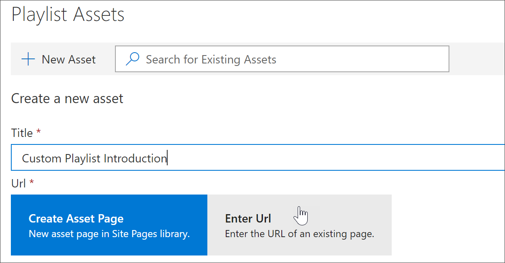

# 將資產新增至自訂播放清單

自訂學習，您可以新增下列資產的播放清單：

- **現有的自訂學習資產**-屬於 Microsoft online 目錄的資產，或您的組織已加到自訂學習的資產。
- **新的資產**-這些是您新增至自訂學習之內建從您建立的 SharePoint 網頁的資產或已在組織中的 SharePoint 網站的 SharePoint 資產。 

> [!TIP]
> 如果 Microsoft 播放清單資產不符合您的需求，建立新的播放清單，然後加入 Microsoft 資產和任何新建立的資產的播放清單來建立您想要的體驗。 您無法修改，由 Microsoft 所提供的自訂學習播放清單，但您可以將自訂的學習提供資產新增至自訂的播放清單。   

## 建立新的資產的播放清單

有兩個選項可將新的資產新增至播放清單。

- **建立資產頁面**-使用此選項，自訂學習會為您產生新的空白 SharePoint 頁面，並將其新增至播放清單。 然後，您可以將內容新增至頁面，並將其儲存。  
- **輸入 URL** -使用此選項，您建立頁面事先或您已提供] 頁面上以及您指定要將頁面新增至播放清單的 URL。

### 建立資產頁面 
**建立資產頁面**選項時，您可以提供資產，標題，然後按一下 [建立資產] 頁面上，以建立並開啟新的 SharePoint 網頁進行編輯。 

1.  如果播放清單尚未開啟供編輯，從 [**自訂學習管理**] 頁面上，按一下您想要編輯播放清單。 
2. 若要新增新的資產播放清單，按一下 [**新的資產**。 
3. 輸入的標題。 在這個範例中，輸入 「 新增資產來播放清單 」，，然後按一下 [**建立資產] 頁面**。

4. 按一下 [**開啟] 頁面**。
5. 按一下 [**編輯**] 圖示，然後按一下 [**編輯網頁組件**標題區域中。
6. 在**版面配置**] 下按一下 [**一般**]。 
7. 新增新的一欄] 區段中，，然後將一些範例文字新增至頁面，讓它看起來如下列範例所示。 

7. 按一下 **[發佈]**。
8. 會傳回**自訂學習管理**] 頁面。 
9. 填寫其餘部分資產的內容，然後再按一下 [**儲存資產。**

### 輸入的 URL
**輸入 URL**選項時，您提供資產，標題，然後按一下 [**輸入 URL** ，以指定您想要新增至播放清單 [SharePoint] 頁面。 

1.  如果播放清單未開啟供編輯，從 [**自訂學習管理**] 頁面上，按一下您想要編輯播放清單。 
2. 若要新增新的資產播放清單，按一下 [**新的資產**。 
3. 輸入的標題。 在這個範例中，輸入 「 自訂播放清單簡介 」，然後按一下 [**輸入 URL**。 

4. 輸入您在先前的[自訂播放清單的建立 SharePoint 頁面](custom_createnewpage.md)] 區段中，建立 SharePoint 網頁的 URL，然後再填寫其餘部分的欄位，如下圖所示。

5. 按一下 [**儲存資產**。 

## 將現有的資產新增至播放清單

現有的資產是由 Microsoft 提供自訂學習資產或資產，都已經新增至自訂學習由您的組織所組成。 

- 在 [**搜尋**] 方塊中，輸入搜尋字詞，然後再選取資產從搜尋結果。 在這個範例中，輸入 「 什麼是 Excel 」？ 若要加入播放清單中的 Excel 簡介主題。

## 編輯、 移動和刪除資產
您可以編輯您建立的自訂資產，但不是從 Microsoft 的資產。 不過，您可以從播放清單中移除所有的資產，並變更順序資產。 

### 編輯資產
- 按一下 [編輯] 按鈕的資產，修改資產，，然後按一下 [儲存資產。 

### 在播放清單中移動資產
- 按向上鍵或向下箭號右邊的資產移動資產順序中播放清單

### 資產移除播放清單
- 按一下 [移除] 從播放清單 X 圖示以資產。 

## 在巨集指令中檢視的播放清單
既然您已新增資產的播放清單，請讓我們先關閉播放清單，並看到它執行動作。 

1. 按一下 [**關閉播放清單**。
2. 按一下 [ **Office 365 訓練**] 頁面] 索引標籤。
3. 重新整理] 頁面上，然後再按一下 [**開始**] 下的 [**第一天**。
4. 按一下 [**自訂學習入門套件**來檢視您的第一個播放清單中巨集指令。 

