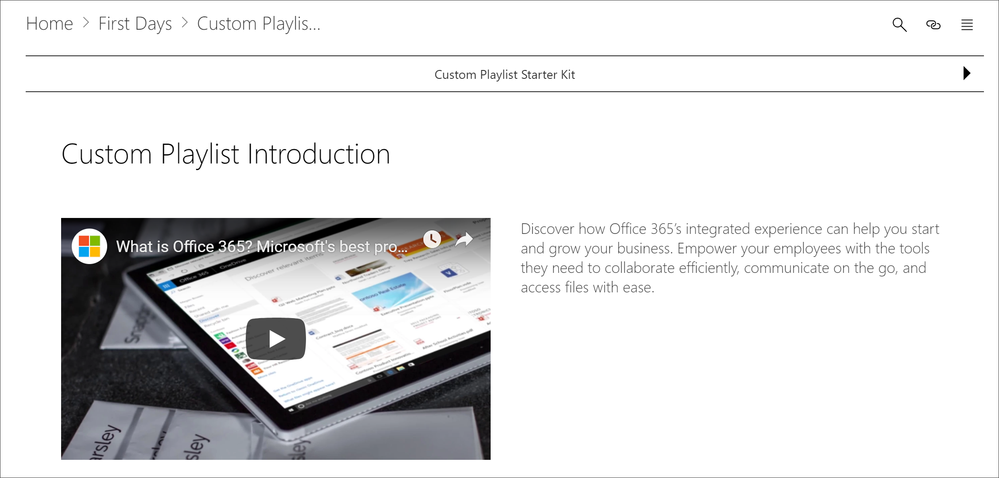

# 將資產新增至自訂播放清單Add Assets to a Custom Playlist

學習路徑，您可以新增至播放清單下的資產：With learning pathways, you can add the following assets to a playlist:

- **現有的 Microsoft 365 學習路徑資產**-屬於 Microsoft online 目錄的資產，或您的組織已加到學習路徑的資產。**Existing Microsoft 365 learning pathways assets** - these are assets that are part of the Microsoft online catalog or assets that your organization has already added to learning pathways.
- **新的資產**-這些是您新增至學習路徑您所建立的 SharePoint 網頁或 SharePoint 的資產已在組織中的 SharePoint 網站上，從內建的資產。**New assets** - these are assets that you add to learning pathways that are built from SharePoint pages that you create or SharePoint assets that are already available on a SharePoint site in your organization. 

> [!TIP]
> 如果 Microsoft 播放清單資產不符合您的需求，建立新的播放清單，然後加入 Microsoft 資產和任何新建立的資產的播放清單來建立您想要的體驗。If a Microsoft playlist asset doesn't meet your needs, create a new playlist and then add the Microsoft assets and any newly created assets to the playlist to build the experience you want. 您無法修改學習路徑播放清單由 Microsoft 所提供，但您可以新增學習路徑提供自訂播放清單的資產。You can't modify learning pathways playlists supplied by Microsoft, but you can add learning pathways-supplied assets to a custom playlist.   

## 建立新的資產的播放清單Create a new asset for a playlist

有兩個選項可將新的資產新增至播放清單。There are two options for adding a new asset to a playlist.

- **建立資產頁面**-使用此選項，學習路徑將會為您產生新的空白 SharePoint 頁面，並將其新增至播放清單。**Create Asset Page** - with this option, learning pathways will generate a new,  blank SharePoint page for you and add it to the playlist. 然後，您可以將內容新增至頁面，並將其儲存。You can then add content to the page and save it.  
- **輸入 URL** -使用此選項，您建立頁面事先或您已提供] 頁面上以及您指定要將頁面新增至播放清單的 URL。**Enter the URL** - with this option, you build the page in advance or you already have the page available and you specify the URL to add the page to the playlist.

### 建立資產頁面Create Asset Page 
**建立資產頁面**選項時，您可以提供資產，標題，然後按一下 [建立資產] 頁面上，以建立並開啟新的 SharePoint 網頁進行編輯。With the **Create Asset Page** option, you provide a title for the Asset, then click Create Asset page to create and open a new SharePoint page for editing. 

1.  如果播放清單尚未開啟供編輯，從 [**自訂學習管理**] 頁面上，按一下您想要編輯播放清單。If the playlist isn't already open for editing, from the **Custom Learning Administration** page, click the playlist you wish to edit. 
2. 若要新增新的資產播放清單，按一下 [**新的資產**。To add a new asset to a playlist, click **New Asset**. 
3. 輸入的標題。Enter a title. 在這個範例中，輸入 「 新增資產來播放清單 」，，然後按一下 [**建立資產] 頁面**。In this example enter “Add Assets to a Playlist”, and then click **Create Asset Page**.

4. 按一下 [**開啟] 頁面**。Click **Open Page**.
5. 按一下 [**編輯**] 圖示，然後按一下 [**編輯網頁組件**標題區域中。Click the **Edit** icon, and then click **Edit Web part** in the Title area.
6. 在**版面配置**] 下按一下 [**一般**]。Under **Layout**, click **Plain**. 
7. 新增新的一欄] 區段中，，然後將一些範例文字新增至頁面，讓它看起來如下列範例所示。Add a new one-column section, and then add some sample text to the page so it looks like the following example. 

7. 按一下 **[發佈]**。Click **Publish**.
8. 會傳回**自訂學習管理**] 頁面。Return to the **Custom Learning Administration** page. 
9. 填寫其餘部分資產的內容，然後再按一下 [**儲存資產。**Fill out the remainder of the properties for the asset, and then click **Save Asset.**

### 輸入的 URLEnter the URL
**輸入 URL**選項時，您提供資產，標題，然後按一下 [**輸入 URL** ，以指定您想要新增至播放清單 [SharePoint] 頁面。With the **Enter the URL** option, you provide a title for the Asset, then click **Enter the URL** to specify the SharePoint page you want to add to the playlist. 

1.  如果播放清單未開啟供編輯，從 [**自訂學習管理**] 頁面上，按一下您想要編輯播放清單。If the playlist isn't open for editing, from the **Custom Learning Administration** page, click the playlist you wish to edit. 
2. 若要新增新的資產播放清單，按一下 [**新的資產**。To add a new asset to a playlist, click **New Asset**. 
3. 輸入的標題。Enter a title. 在這個範例中，輸入 「 自訂播放清單簡介 」，然後按一下 [**輸入 URL**。In this example, enter “Custom Playlist Introduction”, and then click **Enter URL**. 

4. 輸入您在先前的[自訂播放清單的建立 SharePoint 頁面](custom_createnewpage.md)] 區段中，建立 SharePoint 網頁的 URL，然後再填寫其餘部分的欄位，如下圖所示。Enter the URL of the SharePoint page you created in a previous [Create SharePoint pages for custom playlists ](custom_createnewpage.md) section, and then fill out the remainder of the fields, as shown in the following illustration.

5. 按一下 [**儲存資產**。Click **Save Asset**. 

## 將現有的資產新增至播放清單Add an existing asset to a playlist

現有的資產組成提供 Microsoft 學習路徑資產或資產，都已經新增至學習路徑由您的組織。Existing assets consist of Microsoft-provided learning pathways assets or assets that have already been added to learning pathways by your organization. 

- 在 [**搜尋**] 方塊中，輸入搜尋字詞，然後再選取資產從搜尋結果。In the **Search** box, enter a Search phrase, and then select an asset from the Search results. 在這個範例中，輸入 「 什麼是 Excel 」？In this example, enter “What is Excel?” 若要加入播放清單中的 Excel 簡介主題。to add an Excel intro topic to the playlist.

## 編輯、 移動和刪除資產Edit, move, and delete assets
您可以編輯您建立的自訂資產，但不是從 Microsoft 的資產。You can edit custom assets that you create, but not assets from Microsoft. 不過，您可以從播放清單中移除所有的資產，並變更順序資產。However, you can remove all assets from a playlist and change the order assets. 

### 編輯資產Edit an asset
- 按一下 [編輯] 按鈕的資產，修改資產，，然後按一下 [儲存資產。Click the Edit button for an asset, modify the asset, and then click Save Asset. 

### 在播放清單中移動資產Move an asset in a playlist
- 按向上鍵或向下箭號右邊的資產移動資產順序中播放清單Click the up or down arrow to the right of the asset to move the asset order in the playlist

### 資產移除播放清單Remove an asset from a playlist
- 按一下 [移除] 從播放清單 X 圖示以資產。Click the Remove from Playlist X icon for the asset. 

## 在巨集指令中檢視的播放清單View the playlist in Action
既然您已新增資產的播放清單，請讓我們先關閉播放清單，並看到它執行動作。Now that you've added assets to a playlist, let's close the playlist and see it in action. 

1. 按一下 [**關閉播放清單**。Click **Close Playlist**.
2. 按一下 [ **Office 365 訓練**] 頁面] 索引標籤。Click the tab with the **Office 365 training** page.
3. 重新整理] 頁面上，然後再按一下 [**開始**] 下的 [**第一天**。Refresh the page, and then click **First Days** under **Get Started**.
4. 按一下以檢視巨集指令中的第一個播放清單的**學習路徑入門套件**。Click **Learning Pathways Starter Kit** to view your first playlist in action. 

