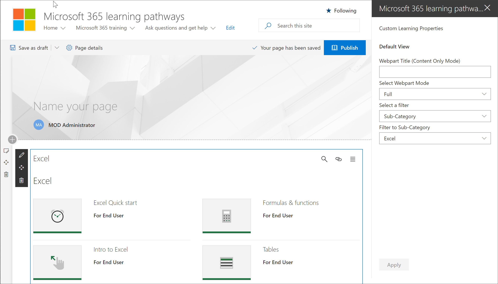

# 新增及編輯 Microsoft 365 學習路徑網頁組件

Microsoft 365 學習路徑可讓您靈活地新增學習路徑網頁組件至 SharePoint] 頁面上，Microsoft 365，然後篩選的網頁組件，以符合頁面的學習目標內容。 例如，您無法建立 「 讓切換至 OneDrive 」 頁面，然後新增網頁組件再將其設定為顯示特別為您的組織建立的自訂 OneDrive 移轉播放清單。

1.  按一下 [SharePoint 齒輪圖示，，然後按一下 [**新增工作] 頁面**。
2.  按一下左側的 [] 頁面上的 [**新增新區段 （+）** ，然後按一下 [**一欄**。
3.  按一下 [ **+**，然後選取 [ **Microsoft 365 學習路徑**網頁組件。 

## 編輯自訂學習網頁組件
您可以編輯 Microsoft 365 學習路徑網頁組件以顯示所有可用自訂學習內容或特定的類別、 子類別、 播放清單或資產。 

1.  按一下 [**編輯網頁組件**]。

2. 在 [自訂學習屬性] 窗格中，篩選下列的網頁組件。 

- 網頁組件模式： 完整
- 篩選： 子類別
- 子類別： Excel

3. 您的頁面現在看起來應該類似下列影像： 

## 新增標題並發佈頁面
1. 在 [頁面的 [標題] 區域中，輸入 「 建立您自己的經驗 」。
2. 按一下標題區域中的 [**編輯網頁組件**] 圖示，選取 [**純文字**在**版面配置**] 下，然後關閉 [**內容**] 窗格。
3. 按一下 **[發佈]**。
