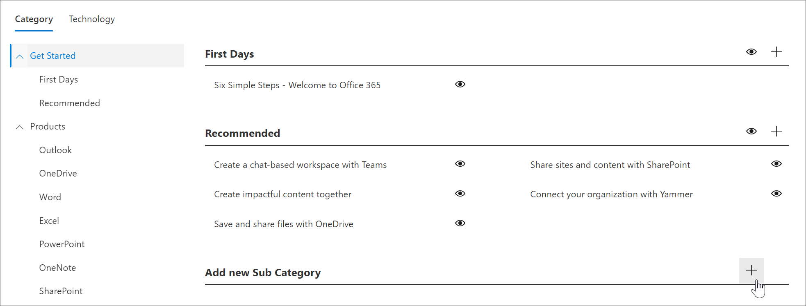

# 建立子類別 
在某些情況下，您會想要建立新的子類別。 例如，如果您的組織無法使用第一天子類別，您可以建立新的子類別，然後新增播放清單以滿足組織的需求。 

1. 從 Microsoft 365 學習路徑 **首頁** ，按一下 [ **Microsoft 365 訓練**]，按一下網頁元件中的 [ **系統** ] 功能表，然後按一下 [ **管理播放清單**]。 
2. 選取 **類別**。 在此範例中，選取 [ **開始**]。  
3. 向下滾動頁面， 
3. 按一下 [ **新增子類 +** ] 圖示。  

> [!TIP]
> Microsoft 提供的子類別可以隱藏，但不能編輯或刪除。 

## 編輯子類別
- 選取 [子類別] 的 [ **編輯** ] 圖示，對子類別標題進行編輯，然後按一下 [ **儲存**]。

## 隱藏子類別
- 選取子類別的 eyeball，以隱藏它。 

## 刪除子類別
- 選取 [子類別] 的 [ **編輯** ] 圖示，然後選取 [ **刪除]。** 
