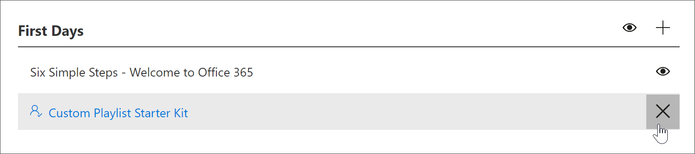

# 建立自訂播放清單Create a Custom Playlist

使用 Microsoft 365 學習路徑，您可量身訂做您的組織的唯一需要從頭開始建立自訂播放清單。With Microsoft 365 learning pathways, you can create custom playlists from scratch that are tailored to the unique needs of your organization. 例如，建立播放清單上架新主講對 Microsoft Teams。For example, create a playlist for onboarding new hires to Microsoft Teams. 使用或是建立播放清單行政人員系統管理員的資訊適用於其唯一的角色。Or create playlists for executive administrators with information suited to their unique role. 或建立 Microsoft 365 播放清單具有三個簡單的步驟，而不是第六個的第一天。Or create a First Day for Microsoft 365 playlist that has three simple steps instead of six. 您可以將自訂的播放清單新增至任何子類別。You can add a custom playlist to any subcategory. 例如，**第一天**、**產品**子類別，例如**Excel**或甚至是您建立子類別。For example, **First Days**, a **Product** subcategory like **Excel**, or even a subcategory that you create. 在這個部分，我們將說明如何建立播放清單，並再涵蓋下列] 區段中，[新增至自訂的播放清單的資產](custom_addassets.md)中播放清單以新增資產。In this section, we’ll cover how to create a playlist, and then cover adding assets to a playlist in the following section, [Add assets to a custom playlist](custom_addassets.md).

## 建立播放清單Create a playlist 

1. 從 Microsoft 365 學習路徑 [**首頁**] 頁面，按一下 [ **Office 365 訓練**，，然後選取 [**管理**] 圖示從網頁組件。From the Microsoft 365 learning pathways **Home** page, click **Office 365 training**, and then select the **Administer** icon from the Web part. 
2. 選取 [**管理**」 圖示子類別。Select the **Administer**" icon  subcategory. 在這個範例中，選取**第一天**。In this example, select **First Days**.  
3. 按一下 [+] 圖示。Click the + icon.  

4.  下列範例所示，請填寫播放清單中的欄位。Fill out the fields in the playlist as shown in the following example. 您可以將此範例中的預設圖示。You can leave the default icon for this example. 

5.  當您完成，請選取**儲存詳細資料**。When you are done, select **Save Detail**. 

## 編輯播放清單Edit a playlist

- 從 [**自訂學習管理**] 頁面上，按一下播放清單，，然後按一下 [**編輯詳細資料**。From the **Custom Learning Administration** page, click the playlist, and then click **Edit Detail**.  

### 刪除播放清單Delete a playlist

- 從 [自訂學習管理] 頁面上，按一下 [播放清單的**刪除**圖示。From the Custom Learning Administration page, click the **Delete** icon for the playlist.  

