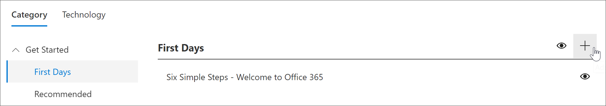

# 建立自訂播放清單

當您建立播放清單時，您第一次使用播放清單的詳細資訊，建立播放清單，然後再新增至播放清單的 [資產。 您可以將播放清單新增至任何子類別。 例如，您可以將播放清單新增至**第一天**子類別或**excel****產品**子類別。 在這個部分，我們將說明如何建立播放清單，並再涵蓋下列] 區段中，[新增至自訂的播放清單的資產](custom_addassets.md)中播放清單以新增資產。

## 建立播放清單 

1. 從自訂學習**首頁**上，按一下 [ **Office 365 訓練**，從 [網頁組件中，選取 [系統] 功能表，然後選取**管理播放清單**。 
2. 選取子類別。 在這個範例中，選取**第一天**。  
3. 按一下 [+] 圖示。  

4.  下列範例所示，請填寫播放清單中的欄位。 您可以將此範例中的預設圖示。 

5.  當您完成，請選取**儲存詳細資料**。 

## 編輯播放清單

- 從 [**自訂學習管理**] 頁面上，按一下播放清單，，然後按一下 [**編輯詳細資料**。  

### 刪除播放清單

- 從 [自訂學習管理] 頁面上，按一下 [播放清單的**刪除**圖示。  

