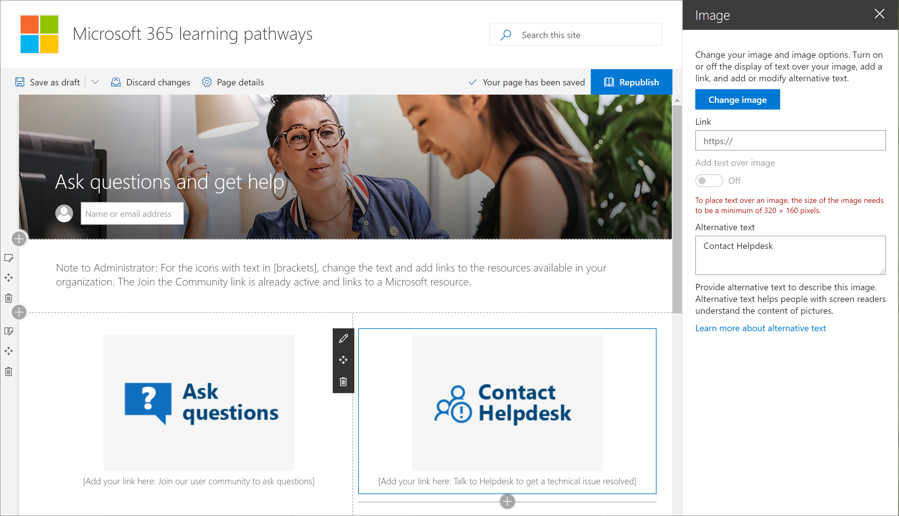

# 自訂網站

Microsoft 365 學習路徑網站是範本為基礎 SharePoint 通訊，所以很容易修改以符合組織需求的網站。 您可以變更網站名稱、 標誌、 功能表項目和頁面上的內容。 

> [!TIP]
> 從您的員工收集意見反應，並定期更新的網站。 例如，您可以更新訓練事件行事曆做為變成可用的新事件。 當啟動新的服務，您可以取消隱藏內容，並建置目標的訓練播放清單設計的新服務啟動。 

## 自訂的網站和網頁

學習路徑網站可完全自訂。 如果您不熟悉如何自訂您的 SharePoint 網站或網頁，我們建議您檢閱[自訂您的 SharePoint 網站](https://support.office.com/en-us/article/customize-your-sharepoint-site-320b43e5-b047-4fda-8381-f61e8ac7f59b)文件，support.office.com 上。 

### 自訂詢問問題，並取得說明

以系統管理員身分的學習路徑網站，您會想要執行的事項是變更上**取得說明及支援中心**] 頁面，指向您的組織中的資源的連結。 

1.  從學習路徑的首頁] 頁面上，按一下 [**提問並取得 [說明**] 功能表項目。
2.  Click the **Edit** button.
3.  將滑鼠停留說明選項映像，然後按一下 [**編輯網頁組件**。

4.  在 [**連結**] 方塊中，輸入內部資源的 URL。 
5.  針對其他兩個影像未連結重複步驟 3 和 4。

### 變更頁面上的文字

1. [文字] 區域中，將游標，然後編輯 [] 頁面上的文字。 
2. 當您完成時按一下 [**發佈**] 按鈕

## 其他自訂選項
您可能要考慮編輯其他的頁面是：

- 訓練事件 calendar.aspx
- Home.aspx Hero 網頁組件

