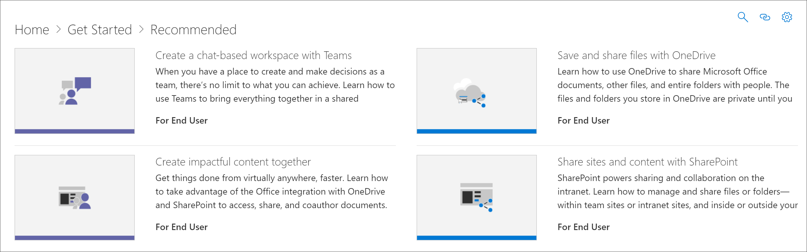

# 隱藏和顯示技術

在某些情況下，您會想要隱藏您的組織中不支援技術的內容。 隱藏技術功能被為了防止技術出現整個網頁組件。 它提供了更廣泛的方法若要隱藏和顯示內容比隱藏子類別或播放清單。 例如，您可以隱藏 Yammer 子類別，但 Yammer 可能仍會出現在特定案例播放清單，如 < 使用 Yammer 連接您的組織 」。 若要確保特定技術不會公開給使用者，您可以將其隱藏技術。 

## 隱藏技術

1. 從自訂學習**首頁**上，按一下 [ **Office 365 訓練**磚。
2. 從自訂學習網頁組件中，選取 [**系統**] 功能表，然後選取**管理播放清單**。 您現在應該可以開啟的兩個索引標籤。 一個使用**自訂學習管理**] 頁面中，而另一個**Office 365 訓練**頁面。 
3. 從**自訂學習管理**] 頁面上，按一下一種**技術**，，然後選取以將它隱藏技術 eyeball。 本範例中，按一下 [ **Yammer**技術，然後再將它隱藏。  

### 確認隱藏播放清單
1. 若要確認隱藏**Yammer**技術，選取與**Office 365 訓練**頁面載入、 瀏覽器] 索引標籤，然後重新整理頁面。 您現在應該會看到的 Yammer 隱藏子類別。 
2. 按一下 [**建議**子類別。 您會注意到連線您的組織使用 Yammer 播放清單會隱藏。 

## 取消隱藏技術

- 從**自訂學習管理**] 頁面的 [**技術**，選取一種技術，然後選取要取消隱藏它隱藏技術 eyeball。 本範例中，取消隱藏**Yammer**技術。 