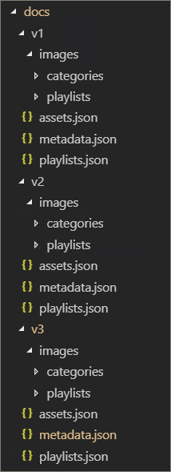

# 合作夥伴整合模型
雖然不可能從「SharePoint 線上布建服務」的 [現成] 直接補充「現成」的 Microsoft 365 教學內容，但有數個整合模型可讓合作夥伴利用這些整合式的價值-新增服務提供服務。 以上的合作夥伴整合模型是以遞增複雜度和投資層級為序呈現。 因此，我們的指導方針是根據您的業務模型，建立更高級別的專業知識及畢業。

## 我應該如何開始？ 
若要開始，請執行以下的一些最佳作法。     

### 1. 以啟用碼的方式建立專業知識。 
您可以透過啟用其學習路徑訓練入口網站及執行目標 Microsoft content curation，協助協助客戶群的百分比。 如需提供學習路徑的指示，請參閱 https://docs.microsoft.com/office365/customlearning/custom_provision 。  

### 2. 然後以集成商的身分擴充服務
根據您的內容和/或服務整合需求的數量，進行「投資回報的自動化」分析。 例如，如果您可以快速手動建立目標自訂播放清單 () 指向您的支付內容或參考您的服務，可能不會對內容整合指導方針採取相關的開發和操作成本。

### 3. 投資回報帶來的意義–考慮再進行重新分佈 
當投資回報有意義時–考慮再發佈 (或使用相關的學習路徑夥伴) 建立重新封包的解決方案。 這些是以 SharePoint 的模式和實踐架構為基礎，其提供解決方案以提取自訂的網站，然後再部署至客戶環境 

## 合作夥伴提供的內容整合指導方針
Microsoft 365 學習路徑的內容是由一組 JSON 檔案所驅動，其充當您的教學套件的內容資訊清單。 有三個檔案： metadata.js開啟、playlists.js開啟] 和 assets.js。 這些檔案必須進行結構化，以符合網頁元件所辨識的模型，然後從內容傳遞網路 (CDN) ，以允許網頁元件載入這些檔案。 Microsoft 會提供這些檔案的 starter 範本，讓您開始。  

**免責聲明：** JSON 檔結構根據即將推出的解決方案運作，視需要變更。 Microsoft 365 教學路徑協力廠商的先期採用計畫 (EAP) 將會獲悉任何對此性質的即將變更。 連同任何客戶向後相容性和/或轉接指引。 

### 下載 Microsoft 365 學習路徑解決方案
您可以從 GitHub 存放庫下載 Microsoft 365 教學路徑方案，以及 JSON 檔案： https://github.com/pnp/custom-learning-office-365 。 請注意，目前 Microsoft 並未採取 GitHub 對解決方案的拉取要求。 不過，您可以使用 GitHub 檔做為建立您自己的自訂內容套件的開始點。 

### 結構上的 Metadata.js
您可以將此檔案看作是功能表和結構的 brains。 它包含其他兩個檔案中的所有導覽結構，以及資料的選取清單。 

|              名稱        |                     描述                                                               | 
|:-----------------------------|-------------------------------------------------------------------------------------------|
|**技術**              |內容已標記，而且可根據其所指派的技術而隱藏。                 |  
|&nbsp;&nbsp;Id                |代表技術的 GUID                                                           |  
|&nbsp;&nbsp;名字              |技術的顯示名稱                                                             |
|&nbsp;&nbsp;*主體 []*     |屬於技術子集的主體陣列                                   | 
|&nbsp;&nbsp;&nbsp;&nbsp;Id    |代表主旨的 GUID                                                              |
|&nbsp;&nbsp;&nbsp;&nbsp;名字  |主體的顯示名稱                                                                |
|**類別 []**             |類別會告知網頁元件的導覽。 每個類別代表最上層流覽的層級                                                                                                                 |
|&nbsp;&nbsp;Id                |代表類別/子類別的 GUID                                                 |
|&nbsp;&nbsp;名字              |類別/子類別的顯示名稱                                                  |
|&nbsp;&nbsp;圖像             |應該顯示在 UX (中的圖像 URL （相對於 CDN 基底) ）            |
|&nbsp;&nbsp;TechnologyId      |與此內容相關的技術 GUID (選用–空字串)             |
|&nbsp;&nbsp;SubjectId         |與此內容相關的主旨的 GUID (選用–空字串)                |
|&nbsp;&nbsp;源            |來源陣列中，除了使用者新增的自訂資料以外，非特別用於 UX 的使用者會標示為 "承租人"，而 UX 系統管理員區域不允許編輯未標示為 "承租人" 的任何專案。                           |
|&nbsp;&nbsp;*子類別 []*|Sub-Categories 基本上是從層級2低的導覽層級。 結構與僅嵌套的類別相同。          |
|**聽眾 []**             |當與類別/子類別相關聯的播放清單是各物件標示時，就可以使用選擇器顯示可用的物件。 |         
|&nbsp;&nbsp;Id                |物件的 GUID                                                                       |  
|&nbsp;&nbsp;名字              |物件的顯示名稱                                                               |       
|**來源 []**               |以其來源標記內容的字串陣列，並非特別用於使用者新增之自訂資料的 UX，也會標示為 "承租人"，而 UX 系統管理員區域不允許編輯未標示為 "承租人" 的任何專案。                                                   |  
|**層級 []**               |當與類別/子類別相關聯的播放清單是標記的各層級時，會顯示可供選取的層級。             |  
|&nbsp;&nbsp;Id                |層級的 GUID                                                                          |  
|&nbsp;&nbsp;名字              |層級的顯示名稱                                                                  | 
|**StatusTag [ ]**           |狀態標記是以 UX 中公開的各種狀態來識別內容。 有些旗標只會對消費者顯示，有些只會向系統管理員顯示。                                                   |  
|&nbsp;&nbsp;Id                |StatugTag 的 GUID                                                                      |  
|&nbsp;&nbsp;名字              |StatusTag 的顯示名稱                                                              | 
|**遙測 []**            |                                                                                           |  
|&nbsp;&nbsp;AppInsightsKey    |您已設定以追蹤檢視器網頁元件載入之 application insights 機碼的 GUID。 整個承租人的系統管理員可以關閉追蹤功能，但傳送的資訊是匿名使用者，具有租使用者識別碼。如需詳細資訊，請參閱本節。 https://github.com/pnp/custom-learning-office-365#disabling-telemetry-collection               |  
|**版本**                   |解決方案會使用版本資訊，向系統管理員指出 webpart 已更新，也可讓 webpart 自行更新自訂內容至最新版本的資訊清單（如果進行了重大的變更）。         | 
|&nbsp;&nbsp;清單          |資訊清單的版本                                               |
|&nbsp;&nbsp;ManifestMinWebPart|搭配版本資訊清單使用的 webpart 的最低版本             |
|&nbsp;&nbsp;CurrentWebPart    |應該顯示在 UX (中的圖像 URL （相對於 CDN 基底) ）            |
|&nbsp;&nbsp;RepoURL           |更新網頁元件指示所在之存放庫的 url。                    |
|**內容套件**             |目前不支援其他 CDN 的內容套件。 內容套件可讓 Microsoft 建議其他 Microsoft 建立的解決方案，這些解決方案可透過利用 M365LP 來傳遞內容及自行自訂 Cdn 的布建服務進行布建。       | 
|&nbsp;&nbsp;Id                |內容套件/CDN 的 GUID                                                              |
|&nbsp;&nbsp;名字              |CDN 的顯示名稱                                                                   |
|&nbsp;&nbsp;描述       |顯示在 UI 中以新增內容套件的描述                               |
|&nbsp;&nbsp;圖像             |顯示在 UI 中以新增內容套件的圖像                                     |
|&nbsp;&nbsp;ProvisionURL      |用於建立內容套件網站集合的布建服務套件 URL  |
|&nbsp;&nbsp;CDNbase           |內容套件的資訊清單基底 URL                                       |
|AssetOrigins                  |稍後所述的檔 assets.js中的 URL 來源陣列。 如果原始 URL 支援它，張貼郵件會傳送給 help_getClientHeight。 在 [資料] 屬性中： "help_getClientHeight = {content}" (例如，"help_getClientHeight = 5769" ) 將允許將 iFrame 大小調整為適當的圖文框內容高度。         |

### 結構上的 Playlists.js
playlists.json –播放清單資訊清單是一個物件陣列，描述有關播放清單和播放清單中所包含之資產的中繼資料。

|              名稱        |                     描述                                                               | 
|:-----------------------------|-------------------------------------------------------------------------------------------|
|識別碼                            |代表播放清單的 GUID                                                             |  
|職稱                         |播放清單的顯示名稱                                                               |
|影像                         |從 CDN)  (到影像以顯示播放清單的相對 URL                              |                      
|LevelId                       |關聯的層級                                                                           |
|AudienceId                   |關聯的物件                                                                        |
|TechnologyId                 |相關的技術                                                                      |
|SubjectId                    |類別/子類別的顯示名稱                                                  |
|來源                        |來源陣列中，並非特別用於使用者新增之自訂資料的 UX，會標示為 "租使用者"，而 UX 系統管理區域不允許編輯未標示為 "承租人" 的任何專案。                                              |
|CatId                         |代表播放清單應顯示之容器的類別或子類別識別碼。 目前的資訊清單不支援選取類別或子類別作為容器（如果它也有子類別）。        |
|描述                   |顯示 UX 中每個播放清單的描述                                           |
|StatusTagId                   |關聯的狀態標記                                                                      |
|StatusNote                    |顯示給系統管理員的內容附注                                            |
|*資產 []*                        |屬於這份播放清單之資產的 GUID 陣列（顯示順序）。        |         

### 結構上的 Asset.js
playlists.json –播放清單資訊清單是一個物件陣列，描述有關播放清單和播放清單中所包含之資產的中繼資料。

|              名稱        |                     描述                                                               | 
|:-----------------------------|-------------------------------------------------------------------------------------------|
|識別碼                            |代表播放清單的 GUID                                                             |  
|職稱                         |播放清單的顯示名稱                                                               |
|描述                   |---                                                                                           |                      
|URL                           |要套用至 iFrame 的資產來源 url                                  |
|TechnologyId                  |相關的技術                                                                      |
|SubjectId                     |相關主題                                                                         |
|來源                        |類別/子類別的顯示名稱                                                  |
|StatusTagId                   |關聯的狀態標記                                                                      |
|StatusNote                    |顯示給系統管理員的內容附注。                                           |

### 快取
目前版本的檢視器網頁元件使用快取版本的資訊清單檔案進行24小時。 在24小時後，命中網頁元件的第一位使用者會透過從來源 CDN 下載資訊清單，並將該資訊與隱藏的技術和播放清單合併，以及在自訂子類別、播放清單及資產中合併，以進行快取，以重新整理快取。 另外，系統管理員網頁元件一定會從資訊清單中下載內容，並將其合併並更新快取。  換句話說，在任何時候，管理員都可以透過載入管理網頁元件，強制進行快取更新，亦即移至 [管理] 頁面。

## 內容套件指導方針
內容套件功能會解除下列案例的鎖定：
- 協力廠商可將增值自訂學習內容自訂新增至客戶環境的能力
- 組織具備強大訓練小組和 IT 支援的能力，可在自己的內部系統和控管上建立自訂的教學內容
- 能夠讓 Microsoft 在未來提供其他學習路徑，讓客戶可以加入宣告

由於功能的複雜性，目前的檔集合特意針對合作夥伴提供此功能。 服務小組積極致力於更好地支援及啟用案例 #2，于未來。 

### 內容套件的運作方式
Microsoft 利用 GitHub 頁面做為內容傳遞網路 (CDN) 來源，以供其資訊清單檔案和影像使用。 我們的 GitHub 存放庫根目錄中有一個檔資料夾，其中包含每個資訊清單檔案版本的子資料夾。 每個資料夾內部都有三個資訊清單檔案，加上一個 images 資料夾，可儲存所有類別、子類別和播放清單影像。 

請務必維護 Microsoft 所用的相同版本架構，讓您選擇以您自己的內容套件擴充學習路徑方案。 您的 CDN 端點不應該包含版本資料夾，因為網頁元件所支援的資訊清單版本會 baked 至該版本，而且會自動附加至 CDN url。 我們顯然會為您提供一些時間，可讓您隨時建立資訊清單檔案的新實例。

 

如需利用 GitHub 頁面作為 CDN 來源的詳細資訊，請參閱下列說明文件： [https://help.github.com/en/articles/configuring-a-publishing-source-for-github-pages](https://help.github.com/en/articles/configuring-a-publishing-source-for-github-pages) 。

Microsoft 的解決方案會將資產的相關資訊提供給公用，因為誰沒有任何可存取這些檔案的安全性。 我們相信消費者的內容應該是免費的，也就是說，如果您需要支付部分或所有內容的支付留言板，您需要在解決方案的技術限制內以不同的方式來執行這項工作，而不是必須使用 GitHub 頁面。 如果您維護我們所述的版本編號結構，您想要使用的任何 CDN 提供者都很好。 如先前所述，網頁元件所支援的資訊清單結構版本會 baked 至程式碼中，並且會自動附加至 CDN URL。 

### 內容套件整合指導 
Admin 和 viewer 網頁元件已擴充，可讓使用者在其承租人中設定其他 CDN 端點，然後允許檢視器網頁元件將其所顯示之資料的來源。 

請記住此功能的主要框架： 
- 這主要適用于協力廠商重新發佈案例–手動播放清單設定過於麻煩 
- 自訂內容套件是一項高級功能，只應該由具有管理 web 內容之經驗的合作夥伴使用。 不信任的內容來源可能會將不安全的內容引入您的網站。 您應只加入您信任的來源。

> **重要事項** 在新增自訂內容套件之前，您必須已布建 Microsoft 365 學習路徑3.0 或更新版本。 如需有關布建 Microsoft 365 學習路徑的 informataion，請參閱布建 [microsoft 365 學習路徑](./custom_provision.md)。

### 內容 Whitelisting
作為合作夥伴，您必須負責協助您的消費者，以確保您的內容在其環境中列入白名單。 我們建議您在環境中建立測試案例，以驗證您的內容可以是在防火牆內部的 SharePoint 頁面中。 遵循 [ [建立 SharePoint 頁面] 以取得自訂播放清單](./custom_createnewpage.md) 指示，確認這屬於這種情況。

### 新增內容套件至學習路徑
當您建立修改 JSON 並定義 CDN 之後，您可以將連絡人套件新增至學習路徑。 

1. 從 [學習路徑] 網站 **首頁** ，指向 [ **首頁** ]，然後按一下 [ **學習路徑管理**]。 
2. 在 [ **管理** ] 頁面 **上，按一下 [...]** 在頁面的右上角新增內容套件。
3. 按一下 [自訂內容套件]，然後輸入內容套件的名稱，然後指定 JSON 檔案所在的 CDN。

   

4. 按一下 [儲存]。 自訂內容套件中的內容現在應該會出現在 [管理] 頁面中。 範例如下。 

   

### 在網頁元件中篩選至內容套件
透過學習路徑，您可以將 [學習路徑] 網頁元件新增至頁面、篩選網頁元件以指向自訂內容套件來源，然後再將網頁元件篩選為您想要的類別、子類別、播放清單及資產。 

1. 在 [學習路徑] 網站上，按一下 [ **新增**]，然後按一下 [ **頁面**]。
2. 按一下 [ **空白**]，然後再 **建立頁面**。
3. 為頁面提供名稱。 
4. 按一下頁面左側的 [ **+ 加入新的區段** ]。
5. 按一下 **+** 新區段的中部，然後新增 [ **Microsoft 365 學習路徑** ] 網頁元件。
6. 按一下網頁元件，然後按一下 [ **編輯** ] 圖示。
7. 在 [ **選取學習來源** ] 方塊中，選取您的自訂內容套件，然後將該網頁元件篩選為您想要的內容。 下列範例提供篩選為自訂內容套件之播放清單之網頁元件的範例。

   