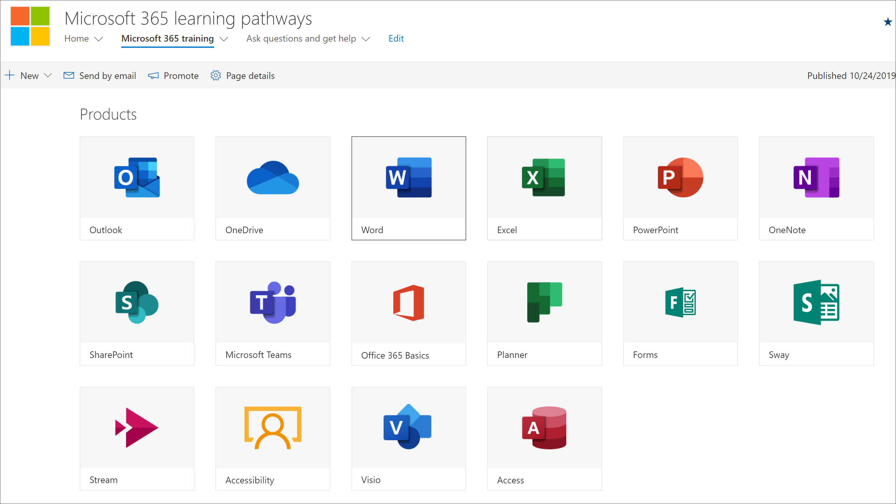

# 規劃學習路徑內容Plan your learning pathways content
在您深入瞭解 Microsoft 365 學習路徑之前，最好花一些時間來調查您可以使用的教學內容、工具及功能。Before you dive into rolling out Microsoft 365 learning pathways, it’s a good idea to take some time to survey the learning content, tools, and capabilities available to you. 我們的目標是協助您盡可能快快捷地為組織的使用者提供速度和生產力。Our goal is to help you get your organization's users up to speed, and productive, as quickly and efficiently as possible. 在規劃學習路徑時，我們建議使用三個步驟的程式：When it comes to planning for learning pathways, we recommend a three-step process:

1. **查看可用的資源** -透過學習路徑和組織中可用的資源所提供的資源。**Review the available resources** – both the resources provided through learning pathways and the resources available in your organization. 最佳的教學計畫會結合組織的 Microsoft 資源和資源。The best learning plans combine both Microsoft resources and resources from your organization.
2. **若要瞭解「學習路徑」工具的功能** ，我們會提供您的快速導覽。**Get to know the capabilities of the Learning Pathways tool** - we'll give you a quick tour. 
3. **建立內容計畫** –回顧可用的採用指南，以協助您建立整體計畫。**Create a content plan** – review the available Adoption Guides to help you with building an overall plan.

## 查看可用的資源Review the available resources
在建立 Microsoft 365 學習路徑的內容計畫之前，請先花些時間探索您可以使用的所有資源。Before you create a content plan for Microsoft 365 learning pathways, take some time to discover all the resources that are available to you.  

### 複查 SharePoint 網站的學習路徑Review the learning pathways SharePoint site
Microsoft 365 學習路徑解決方案提供與連線至線上目錄之網頁元件的 SharePoint 通訊網站。The Microsoft 365 learning pathways solution provides a SharePoint communication site with a web part that's connected to an online catalog. SharePoint 網站可以完全自訂，包括網站名稱、徽標、頁面、功能表項目、主題及麻將牌。The SharePoint site is fully customizable, including the site name, logo, pages, menu items, themes, and tiles. 請花些時間按一下平鋪及功能表項目目，以找出學習路徑網站提供的功能。Take some time to click the tiles and menu items to discover what's available with the learning pathways site.

### 透過網頁元件查看線上目錄中的內容Review the content from the Online catalog with the Web part
根據預設，網頁元件會新增至 SharePoint 通訊網站中的一系列頁面。The Web part, by default, is added to a series of pages in the SharePoint Communication site. 完整的一組內容會在 Microsoft 365 訓練頁面上提供。The complete set of content is provided on the Microsoft 365 training page. Microsoft 365 訓練頁面會主控「學習路徑」網頁元件，設定為顯示所有可用於學習路徑的訓練。The Microsoft 365 training page hosts the learning pathways Web part configured to show all the training available for learning pathways. 

**若要查看 Microsoft 365 訓練頁面****To view the Microsoft 365 Training page**
1. 按一下 [Microsoft 365 訓練] 功能表項目。Click the Microsoft 365 training menu item. 
1. 向右下向左下頁面以查看所有類別和子類別。Scroll down the page to view all the categories and subcategories.
2. 一位開始輪胎。Kick the tires a bit. 按一下一些子類別，然後按一下一些播放清單，以瞭解如何組織學習路徑內容。Click a few subcategories, and then click a few playlists to get a feel for how learning pathways content is organized. 

### 查看管理頁面View the Administration Page
[管理] 頁面提供可供您使用的內容清單。The Administration page provides a listing of the content available to you. 您可以在此位置隱藏內容、建立新的播放清單，以及新增、編輯和移除播放清單。This is where you can hide content, create new playlists, and add, edit, and remove playlist. 依序按一下各種類別和播放清單，以查看可用內容的完整 breath。Click through the various categories and playlists to see the full breath of the content available. 

**以查看管理頁面。****To view the Administration page.**
1. 在 [學習路徑] 網站上，指向 [首頁功能表] 箭號，然後按一下 [學習路徑管理]。From the learning pathways site, point to the Home menu dropdown arrow, then click Learning pathways Administration.  
2. 然後，按一下各種類別、子類別和播放清單，以瞭解可供您使用的內容 breath。Then click through the various categories, subcategories, and playlists to get a feel for the breath of content available to you. 

   ![[範例路徑選項] 視窗。](media/cg-adminsuccesscenterplan_02.png)

### 深入瞭解 Microsoft 365 學習路徑的功能Get to know the capabilities of Microsoft 365 Learning Pathways
透過 Microsoft 365 學習路徑，您可以將 Microsoft 所提供的內容與您所建立的內容搭配使用，以指定您的組織獨有的特定原則及程式。With Microsoft 365 Learning Pathways, you can have content provided by Microsoft mixed with content you create to target specific policies and procedures that are unique to your organization. 最佳作法是儘量盡可能利用 Microsoft 提供的內容。As a best practice, try to leverage Microsoft-provided content as much as possible. Microsoft 會定期更新個別的資產，並每季更新完整的內容清單。Microsoft updates individual assets on a regular basis and updates the full inventory of content on a quarterly basis. 通常組織會建立10-20% 的獨特內容，然後將其餘的80% 保留在 Microsoft，以維持最新狀態。Typically an organization will create 10-20% unique content, then leave the remaining 80% to Microsoft to keep up-to-date. 下列清單說明如何組織學習路徑內容，以及可修改或建立之內容的指導方針。The following lists describes how learning pathways content is organized, along with guidelines for the content that can be modified or created. 自訂內容的指導方針于「管理員成功中心」的 [自訂學習路徑] 區段中提供。Guidance for customizing content is provided in the Customizing learning pathways section of the Admin Success Center.

- **類別** -屬於子類別的容器。**Categories** - are containers for subcategories. 類別是由 Microsoft 提供，無法建立或修改。Categories are provided by Microsoft and cannot be created or modified.
- **子類別** -播放清單的容器。**Subcategories** - are containers for playlists. Microsoft 提供了您無法修改的子類別，但您可以建立您自己的子類別。Microsoft provides subcategories which you cannot modify, but you can create your own subcategories. 
- **播放清單** -是資產的容器。**Playlist** - are containers for assets. Microsoft 提供了您無法修改的播放清單，但您可以建立您自己的播放清單。Microsoft provides playlists which you cannot modify, but you can create your own playlists.  
- **資產** -播放清單中的學習頁面。**Assets** - are the learning pages within playlist. Microsoft 會在您無法修改的播放清單中提供資產，但您可以建立自己的資產並將其新增至播放清單。 estMicrosoft provides assets in playlists which you cannot modify, but you can create your own assets and add them to playlists.est

### 查看 Microsoft 的其他資源Review additional resources from Microsoft
Microsoft 提供的說明和訓練資源，可供您在規劃學習路徑的內容時利用。Microsoft provides help and training resources that you can leverage when planning for content for learning pathways.  

-  [Office 說明和訓練Office Help and Training](https://support.office.com)
-  [Office 365 訓練中心Office 365 Training Center](https://support.office.com/office-training-center)

### 回顧組織中的學習資源Review the learning resources in your organization
讓您的組織中已提供的學習內容進行脫銷。Take stock of the learning content already available to you in your organization.
例如，您的組織可能已經有一些自訂的快速入門手冊、一些工作表，或是專為 Microsoft 365 準備工作、HelpDesk、上架或訓練的 SharePoint 頁面。For example, your organization have may already have custom Quick Start Guides, Cheat Sheets, or SharePoint pages dedicated to Microsoft 365 readiness, HelpDesk, onboarding or training. 現有的 SharePoint 資產可納入至 Microsoft 365 入口網站清單，或與播放清單中的 Microsoft 內容混用，以建立組織的目標播放清單。Existing SharePoint assets can be incorporated into the Microsoft 365 Portal playlists and or mixed with Microsoft content in a playlist to build a targeted playlist for your organization. 如需使用 Microsoft 內容混用組織內容的詳細資訊，請參閱 [自訂學習路徑](custom_overview.md)。自訂「管理員成功中心」的「學習路徑」區段。For more information about mixing your organization's content with Microsoft's content, see the [Customizing learning pathways](custom_overview.md).Customizing learning pathways section of the Admin Success Center.

### 利用採用資源Leverage the Adoption Resources
請注意，您可以在幾天內開始使用學習路徑，但最好先執行一些前期規劃，再執行學習活動策略以上架新的技術或一組服務。Note that you can get started using learning pathways within days, but it’s best to do some up-front planning before executing a learning campaign strategy to onboard a new technology or set of services. 在規劃整體變更管理策略時，開發內容計畫及使用學習路徑是非常廣泛的一部分，因此我們提供您可用於規劃整體策略的採用材料。Developing a content plan and using learning pathways is really part of a more extensive effort in planning an overall Change Management strategy, so we provide adoption materials that you can leverage for planning your overall strategy. 在規劃工作中，請參閱 [採用資源](https://resources.techcommunity.microsoft.com/adoption/)。As part of your planning effort, check out [Adoption Resources](https://resources.techcommunity.microsoft.com/adoption/).

### 建立學習計劃及逐一查看Build a Learning Plan and Iterate 
許多已順利推出學習路徑的公司，都採用了著重于特定案例或技術的學習活動。Many companies who’ve successfully rolled out Learning Pathways have adopted Learning campaigns focusing on specific scenarios or technologies. 例如，「更具共同合作-使用團隊」或「使用 Outlook mobile 更具行動裝置」。For example, "Be more collaborative - using Teams" or “Be more mobile with Outlook mobile.” 您可以使用 [可下載的採用套件](https://teamworktools.azurewebsites.net/m365lp/m365lpadoptionkit.zip)，查看潛在學習活動的範例。You can see examples of potential learning campaigns using the [downloadable Adoption Kit](https://teamworktools.azurewebsites.net/m365lp/m365lpadoptionkit.zip).

 
