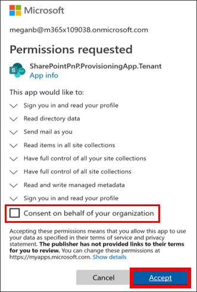

# 佈建自訂學習 

SharePoint Online 佈建服務時，Office 365 租用戶系統管理員可以啟動簡單按幾下的佈建程序。 佈建服務是佈建自訂學習建議的方式。 它是快速又簡單，而且只需幾分鐘開始程序。 開始之前與佈建服務，但請確定您已符合佈建的必要條件。

## 必要條件
 
若要成功設定自訂學習與佈建服務，執行佈建的人員必須符合下列先決條件： 
 
- 佈建自訂學習的人員必須是租用戶的租用戶系統管理員將佈建自訂學習。  
- 租用戶應用程式目錄必須能夠使用中的 SharePoint 系統管理中心的 [應用程式] 選項。 如果您的組織沒有 SharePoint 租用戶應用程式目錄，請參閱[SharePoint Online 的文件](https://docs.microsoft.com/en-us/sharepoint/use-app-catalog)建立一個。  
- 佈建自訂學習的人員必須是租用戶應用程式目錄網站集合擁有人。 如果佈建自訂學習人員不是網站集合擁有人的應用程式目錄[完成這些指示](addappadmin.md)，並繼續執行。 

### 若要佈建自訂學習

1. 移至 [ http://provisioning.sharepointpnp.com ，並從 [首頁] 頁面的右上角的 [**登入**。  使用認證登入您要安裝網站範本已設定目標租用戶。

2. 清除**同意代表您的組織**，然後選取 [**接受**]。

3. 捲動 [] 頁面上，選取 [**解決方案**] 索引標籤，然後選取 [**自訂學習運作的 Office 365**。 

4. 選取 [**新增至您的租用戶**

5. 完成安裝適當地佈建的 [資訊] 頁面上的欄位。 在最低限度下輸入想要取得以佈建到網站佈建程序與目的地 URL 的相關通知的電子郵件地址。  
> [!NOTE]
> 讓您網站的目的地 URL 至員工，例如 「 / 網站/MyTraining 」 或 「 / teams/LearnOffice365 「 易記的某個項目。

6. 選取 [**佈建**時安裝自訂學習到您的租用戶環境準備就緒]。  佈建程序需要 15 分鐘。 將會透過 （若要在佈建] 頁面所輸入的通知電子郵件地址） 的電子郵件通知您該網站時可供存取。 

> [!IMPORTANT]
> 租用戶系統管理員佈建自訂學習網站必須移至網站，並再開啟 [ **CustomLearningAdmin.aspx**初始化自訂學習系統屬性。 現階段，租用戶系統管理員也應該將指派擁有者至網站。 

## 驗證成功佈建並初始化 CustomConfig 清單

佈建完成時，租用戶系統管理員佈建網站上，會收到一封電子郵件從 PnP 佈建服務。 電子郵件包含網站的連結。 此時，租用戶系統管理員應移至使用中電子郵件提供和設定用於第一次使用網站的連結的網站：

1. 請移至 `<YOUR-SITE-COLLECTION-URL>/SitePages/CustomLearningAdmin.aspx`。 開啟**CustomLearningAdmin.aspx**初始化設定為第一次使用的自訂學習**CustomConfig**清單項目。 您應該會看到看起來像這樣的頁面：

## 將擁有者新增至網站
租用戶系統管理員，也不太可能您要自訂網站，讓您將需要指派至網站的幾個擁有者的人。 讓他們可以修改網站頁面並 rebrand 網站擁有人在網站上擁有系統管理權限。 他們也能夠隱藏和顯示內容傳遞到自訂學習網頁組件。 此外，他們必須能夠建置自訂播放清單，並將它們指派給自訂的子類別。  

1. 從 SharePoint**設定**] 功能表中，按一下 [**網站權限**]。
2. 按一下 [**進階權限設定**。
3. 按一下 [**自訂學習 for Office 365 擁有者**。
4. 按一下 [**新增** > **將使用者新增到這個群組**，然後新增您想要做為擁有者的人員。 
5. 在共用郵件中，將連結新增至[瀏覽網站](https://docs.microsoft.com/en-us/Office365/CustomLearning/custom_explore)，然後按一下 [**共用**]。

### 後續步驟
- 瀏覽網站和網頁組件中所提供的[預設的內容](custom_exploresite.md)。
