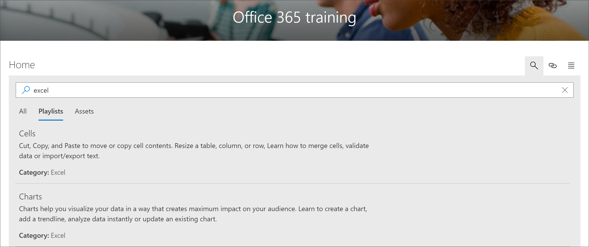

# Microsoft 365 學習路徑內容搜尋

Microsoft 365 學習路徑提供子類別、 播放清單或資產所搜尋內容的能力。 

> [!TIP]
> Microsoft 365 學習路徑搜尋的範圍限定為學習路徑內容，包括由 Microsoft 和新增至自訂播放清單或子類別的任何內容所提供的內容。 SharePoint 頁面，並不是播放清單不包含在搜尋結果學習路徑。     

- 按一下 [**搜尋**] 圖示，然後輸入搜尋字詞。 

