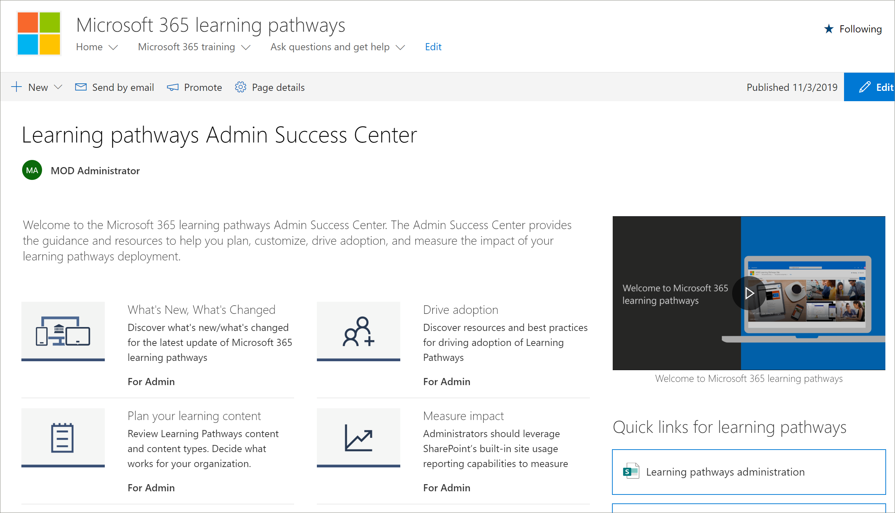

# 學習路徑管理員成功中心

歡迎使用 Microsoft 365 教學路徑管理員成功中心。 「系統管理」成功中心提供指導和資源，可協助您規劃、自訂、促進採用，以及衡量學習路徑部署的影響。

## 登入 Office 365 

1.  開啟網頁瀏覽器，並瀏覽至 office.com 或貴組織的登入位置。 
2.  使用您的使用者名稱和密碼登入。
3.  使用您的承租人系統管理員提供的 URL，流覽至網站的位置，或從 Office 365 首頁選取 [SharePoint]，然後選取網站。 

### 開始使用系統管理員成功中心

「系統管理」成功中心提供指導和資源，可協助您規劃、自訂、促進採用，以及衡量學習路徑部署的影響。 

- 從 [Microsoft 365 **學習路徑] 首頁，** 按一下 **[開始使用系統管理員成功中心**]。

學習路徑會在解決方案的系統管理員成功中心內提供指導方針。 本檔集中也提供系統管理員成功中心的檔： 

- [規劃您的學習內容](custom_plancontent.md)
- [自訂學習路徑](custom_overview.md)
- [磁片磁碟機採用](driveadoption.md)
- [衡量影響](custom_measureimpact.md)

