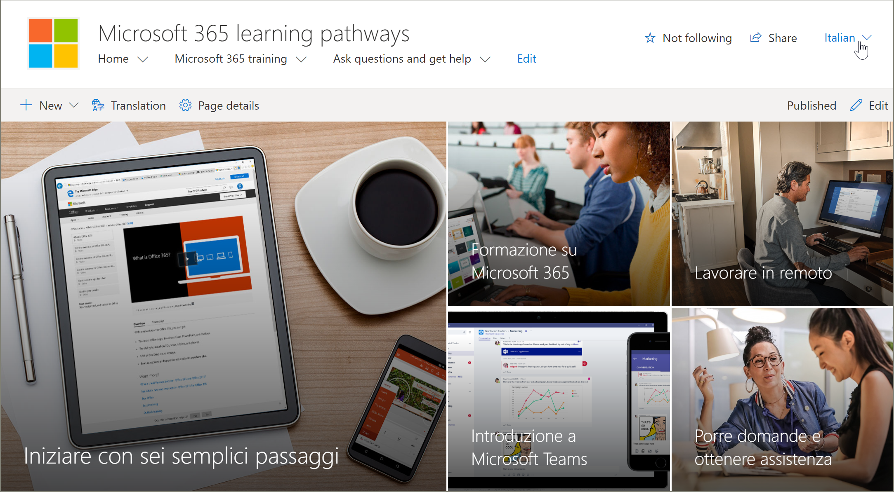
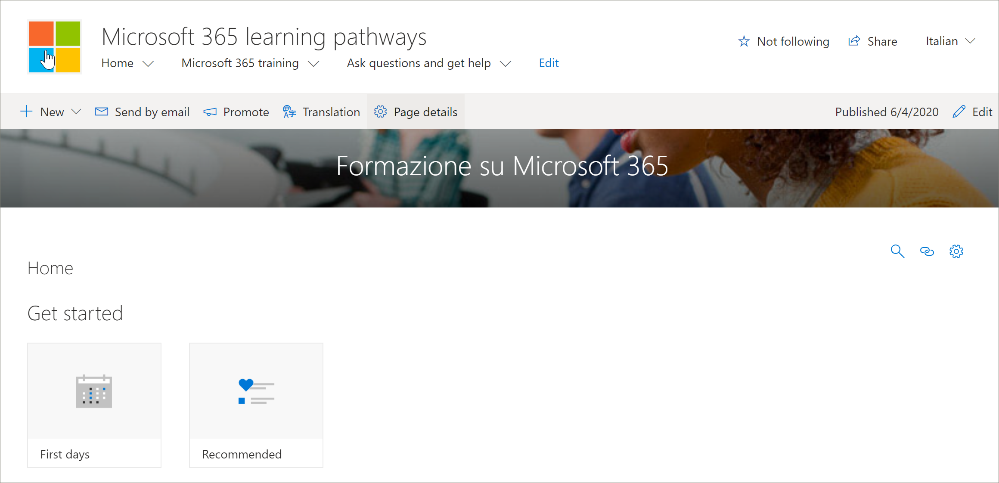

# 轉譯網站頁面
在您開始翻譯「學習路徑」網站之前，請務必瞭解多語系功能如何搭配學習路徑使用的幾個重要概念。 
- 網站資訊-導覽、標誌和網站名稱轉譯需要在使用者的語言設定檔中查看網站。  
- 「學習路徑」網頁元件必須以使用者的語言設定檔進行查看，其才會以非英文語言顯示。 網頁元件和 Microsoft 提供的內容已為您轉譯。
- 您用來布建學習路徑的方法會決定您是否已翻譯頁面，或是否需要手動轉譯頁面。 

## 使用新布建的網站
如果您從 SharePoint 布建服務布建新的學習路徑網站，已翻譯的頁面已可供您使用。 根據預設，網站會提供下列頁面：

- 首頁 .aspx
- Start-with-Six-Simple-Steps .aspx
- Get-started-with-Microsoft-365 .aspx
- Get-started-with-Microsoft-Teams .aspx
- Get-started-with-SharePoint .aspx
- Get-started-with-OneDriive .aspx
- Ask-questions-and-get-help .aspx
- 訓練事件-.aspx
- Become-a-Champion .aspx
- Recommended-Playlists .aspx
- 學習路徑管理員成功中心

## 從新布建的網站查看已翻譯的頁面
若要熟悉已翻譯的學習路徑網站，讓我們看看一些翻譯的頁面。

### 查看轉譯後的首頁
從 [學習路徑] 首頁的 [語言] 下拉式清單中，選取語言，如下列範例所示。 在此範例中，您會看到在右上角選取義大利文。

### 查看已翻譯的 Microsoft 365 訓練頁面
為了協助示範一些重要概念，讓我們看一下 Microsoft 365 訓練頁面。 

1. 從 [學習路徑] 網站**首頁**，按一下 [ **Microsoft 365 訓練**]。
2. 在頁面的右上角，選取語言。 在此範例中，會選取義大利文。

在選取語言時會顯示哪些翻譯？
- SharePoint 頁面的轉譯方式如下圖所示。 請注意，網頁橫幅的文字現在已是義大利文。

哪些翻譯無法顯示？
- 網站名稱為英文
- 網站導航是英文的
- 「學習路徑」網頁元件是英文

## 查看完全翻譯的網站 
若要以特定語言（包括網站頁面、導覽和網頁元件）來查看完全翻譯的網站，必須為該語言設定使用者的個人語言和區域設定。 如需設定語言和區域設定的詳細資訊，請參閱[變更您的個人語言和區域設定](https://support.microsoft.com/en-us/office/change-your-personal-language-and-region-settings-caa1fccc-bcdb-42f3-9e5b-45957647ffd7)。 請注意，使用不同的帳戶或讓另一位具有不同語言設定的使用者可以查看已翻譯的頁面。 

## 使用更新或手動安裝的學習路徑網站
如果您已更新現有的學習路徑網站，或已手動將網頁元件安裝至現有的網站，則必須手動轉譯網站頁面。 「學習路徑」網頁元件和內容已翻譯，而且會以使用者慣用的語言顯示。 若要翻譯頁面，請參閱下列說明：「建立所需語言的頁面」。 

## 建立所需語言的頁面
一旦您已啟用您的網站的多語系功能，且您已選擇想要使用的語言，即可建立所需的翻譯頁面。 

1. 移至您想要以其他語言使用的預設語言頁面。
2. 在頂端列上，選取 [轉譯]。
3. 針對您想要的語言，選取 [建立]。

> [!IMPORTANT]
> 在您建立翻譯頁面後，您必須發佈（或重新發佈） [預設語言] 頁面，以確定下列事項：
>- 翻譯頁面會顯示在對應的語言網站中
>- 翻譯頁面在新聞網頁元件和醒目提示的內容網頁元件中正確顯示
>- 網站頂端的語言下拉式功能表包含您已啟用的所有語言
>- 翻譯人員會收到轉譯要求的通知。

建立頁面後，頁面的狀態（草稿儲存、發佈等等）會顯示在每一種語言旁的轉譯窗格中。 此外，您指派的轉譯器也會在電子郵件中收到要求轉譯的電子郵件。

### 以特定語言查看完全翻譯的網站
若要以特定語言（包括網站頁面、導覽和網頁元件）來查看完全翻譯的網站，必須為該語言設定使用者的個人語言和區域設定。 如需設定語言和區域設定的詳細資訊，請參閱[變更您的個人語言和區域設定](https://support.microsoft.com/en-us/office/change-your-personal-language-and-region-settings-caa1fccc-bcdb-42f3-9e5b-45957647ffd7)。 請注意，使用不同的帳戶或讓另一位具有不同語言設定的使用者可以查看已翻譯的頁面。

## 翻譯工具的作用是什麼？
 在以英文設定網站後，以西班牙文為使用者的使用者，會以西班牙文的個人語言手動編輯，並將標題、導覽及頁尾內容翻譯成西班牙文。 以德文做為偏好的個人語言的使用者，對德文的作用相同。 翻譯內容之後，它會顯示所有慣用語言的使用者。 網頁元件會挑選使用者的慣用語言，並顯示以該語言翻譯的內容。 

翻譯人員會以手動方式將預設語言頁面的副本轉譯成指定的語言。 建立頁面的副本時，會以電子郵件通知翻譯人員。 電子郵件包含預設語言頁面與新建立的翻譯頁面的連結。 翻譯人員將：
1. 選取電子郵件中的 [**開始翻譯**] 按鈕。
2. 在頁面右上方選取 [**編輯**]，然後翻譯內容。
3. 完成後，請選取 [**儲存為草稿**] （如果您未準備好讓讀者看到此頁面），或者，如果頁面可供在網站上使用該語言的所有人看到，請選取 [**發佈**] 或 [**張貼新聞**]。

如需翻譯程式的詳細資訊，請參閱[建立多語系通訊網站、頁面和新聞](https://support.office.com/en-us/article/2bb7d610-5453-41c6-a0e8-6f40b3ed750c)。 

## 更新預設語言頁面
當 [預設語言] 頁面更新時，必須重新發佈頁面。 然後，翻譯頁面的翻譯人員會收到電子郵件通知，表明已進行更新，使其可對個別的翻譯頁面進行更新。

## 設定多語系網站名稱、導覽及頁尾
若要以您所提供的不同語言顯示網站名稱、導覽及頁尾，必須以手動方式轉譯。

例如，假設您已建立具有英文預設語言的通訊網站，且已啟用西班牙文和德文語言的網站。 當您建立網站時，會以預設語言（在此例中為英文）設定網站名稱和描述。 您也可以在建立網站後，更新網站名稱和描述。 然後，您會以英文建立流覽節點及頁尾內容。

在以英文設定網站後，以西班牙文作為慣用個人語言的使用者會以手動方式編輯和轉譯標題、描述、導航及頁尾內容，轉化為西班牙文。 以德文做為偏好的個人語言的使用者，對德文的作用相同。 翻譯內容之後，它會顯示所有慣用語言的使用者。 

> [!注釋
>- 翻譯其偏好語言之網站內容的使用者，應為網站擁有者群組的成員，或具有對等網站許可權。
>- 如果以預設語言對網站名稱、導覽或頁尾進行變更，則其他語言的對應轉譯專案不會自動更新，除非您選擇覆寫現有的網站翻譯。 如果您這麼做，已轉譯的專案會以預設語言的更新取代，必須重新手動轉譯。 若要覆寫翻譯，請移至預設語言的 [網站語言] 頁面，然後選取 [顯示高級設定]。 然後，滑動切換按鈕以將翻譯覆寫為 [開啟]。 此選項不適用於 [頁面] 或 [新聞] 內容。

### 以特定語言查看完全翻譯的網站
若要以特定語言（包括網站頁面、導覽和網頁元件）來查看完全翻譯的網站，必須為該語言設定使用者的個人語言和區域設定。 如需設定語言和區域設定的詳細資訊，請參閱[變更您的個人語言和區域設定](https://support.microsoft.com/en-us/office/change-your-personal-language-and-region-settings-caa1fccc-bcdb-42f3-9e5b-45957647ffd7)。 請注意，使用不同的帳戶或讓另一位具有不同語言設定的使用者可以查看已翻譯的頁面。

## 相關資訊
- 如需翻譯 SharePoint 通訊網站頁面的詳細資訊，請參閱[建立多語系通訊網站、頁面和新聞](https://support.office.com/en-us/article/2bb7d610-5453-41c6-a0e8-6f40b3ed750c)。
- 如需自訂學習路徑的詳細資訊，請參閱[自訂學習路徑](custom_overview.md)。  
