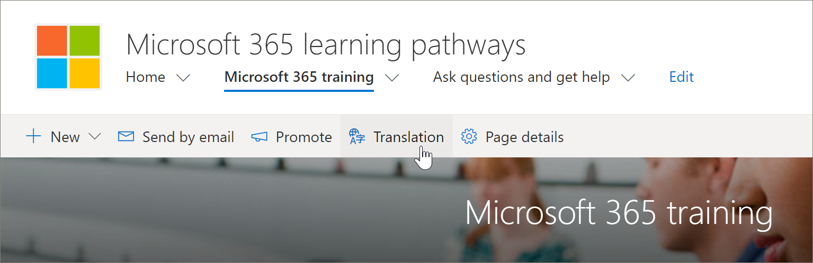

# 轉譯網站頁面
不論您是否已將現有的學習路徑版本更新為版本4.0，或您已布建新的網站，翻譯網站頁面的程式都是相同的。 不過，有一些事項需要注意。 
- 當您布建新的教學的多語系4.0 版本時，會將網站頁面翻譯成9種語言。 
- 當學習路徑方案更新為多語系4.0 版本時，教學路徑 SharePoint 網站頁面會保持不變。 必須手動進行翻譯。 

「學習路徑」網站的預設提供下列頁面：

- 首頁 .aspx
- Start-with-Six-Simple-Steps .aspx
- Get-started-with-Microsoft-365 .aspx
- Get-started-with-Microsoft-Teams .aspx
- Get-started-with-SharePoint .aspx
- Get-started-with-OneDriive .aspx
- Ask-questions-and-get-help .aspx
- 訓練事件-.aspx
- Become-a-Champion .aspx
- Recommended-Playlists .aspx
- 學習路徑管理員成功中心

## 建立所需語言的頁面
一旦您已啟用您的網站的多語系功能，且您已選擇想要使用的語言，即可建立所需的翻譯頁面。 為了協助示範一些重要概念，我們會使用 Microsoft 365 訓練頁面做為範例。 若要執行這項操作，請執行下列步驟：

1.  從 [學習路徑]**首頁**，按一下 [ **Microsoft 365 訓練**]。  
2.  在頂端列上，選取 [**轉譯**]。

3. 如果您想要建立頁面以供網站使用的所有語言的翻譯，請選取 [**為所有語言建立**]。 否則，請選取 [僅針對您想要的語言**建立**]。 在此範例中，我們會選取 [義大利]。
4.  按一下 [**查看**]。 頁面現在可供翻譯。 

### 知道的重要概念
請注意，在下列範例中，頁面已轉譯成義大利文。 但網站標題、導覽和網頁元件仍然會以英文顯示。 

 在以英文設定網站後，以西班牙文為使用者的使用者，會以西班牙文的個人語言手動編輯，並將標題、導覽及頁尾內容翻譯成西班牙文。 以德文做為偏好的個人語言的使用者，對德文的作用相同。 翻譯內容之後，它會顯示所有慣用語言的使用者。 網頁元件會挑選使用者的慣用語言，並顯示以該語言翻譯的內容。 

> [!IMPORTANT]
> 重要事項：在您建立翻譯頁面後，您必須發佈（或重新發佈）預設的英文語言頁面，以確定：
- 翻譯頁面會顯示在對應的語言網站中
- 翻譯頁面在新聞網頁元件和醒目提示的內容網頁元件中正確顯示
- 網站頂端的語言下拉式功能表包含您已啟用的所有語言
- 翻譯人員會收到轉譯要求的通知。

## 翻譯工具的作用是什麼？
翻譯人員會以手動方式將預設語言頁面的副本轉譯成指定的語言。 建立頁面的副本時，會以電子郵件通知翻譯人員。 電子郵件包含預設語言頁面與新建立的翻譯頁面的連結。 翻譯人員將：
1. 選取電子郵件中的 [**開始翻譯**] 按鈕。
2. 在頁面右上方選取 [**編輯**]，然後翻譯內容。
3. 完成後，請選取 [**儲存為草稿**] （如果您未準備好讓讀者看到此頁面），或者，如果頁面可供在網站上使用該語言的所有人看到，請選取 [**發佈**] 或 [**張貼新聞**]。

如需翻譯程式的詳細資訊，請參閱[建立多語系通訊網站、頁面和新聞](https://support.office.com/en-us/article/2bb7d610-5453-41c6-a0e8-6f40b3ed750c)。 

## 更新預設語言頁面
當 [預設語言] 頁面更新時，必須重新發佈頁面。 然後，翻譯頁面的翻譯人員會收到電子郵件通知，表明已進行更新，使其可對個別的翻譯頁面進行更新。

## 後續步驟
- [轉譯自訂播放清單](custom_translate_pl_ml.md)
- [隱藏及顯示 multiligual 內容](custom_translate_pl_ml.md)
