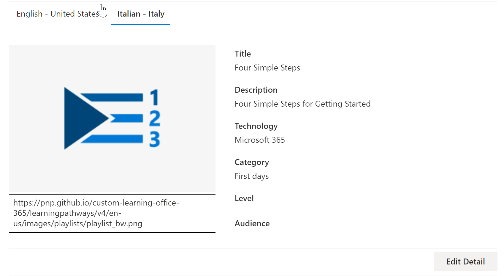

# 翻譯學習路徑自訂播放清單Translate learning pathways custom playlists
透過學習路徑，使用自訂播放清單的方式，取決於您設定學習路徑的方式。With Learning Pathways, the way you work with custom playlists depends on how you set up learning pathways.  

- 如果您已布建新的學習路徑多語系網站，您可以複製或建立新的播放清單，然後將播放清單轉譯為網站所支援的語言。If you provisioned a new learning pathways multilingual site, you can copy or create a new playlist and translate the playlist into the languages that the site supports.
- 如果您已升級現有的自訂播放清單的學習路徑網站，您可以將現有的播放清單轉譯成您的網站所支援的語言。If you upgraded an existing learning pathways site that has pre-existing custom playlists, you can translate the existing playlists into the languages that your site supports. 您也可以複製及建立新的播放清單。You can also copy and create new playlists. 

> [!IMPORTANT]
> - 除非您建立播放清單複本，否則 Microsoft 提供的播放清單已翻譯且無法修改。Microsoft-supplied playlists are already translated and can't be modified unless you create a copy of the playlist. 

## 建立或複製播放清單並將其翻譯Create or copy a playlist and have it translated
如果您已布建新的學習路徑多語系網站，或已使用多語系網頁元件升級網站，您可以複製或建立自訂的播放清單，然後將播放清單和播放清單資源翻譯為網站所支援的語言。If you've provisioned a new learning pathways multilingual site or upgraded the site with the multilingual web part, you can copy or a create custom playlist and translate the playlist and playlist assets into the languages supported by your site. 

### 複製播放清單並將其翻譯Copy a playlist and have it translated
為了示範如何建立新的自訂播放清單並將其翻譯，我們會使用學習路徑的複製播放清單功能。To demonstrate how to create a new custom playlist and have it translated, we'll use the Copy playlist feature of learning pathways.

1.  從 [學習路徑] [ **主** ] 功能表中，按一下 [ **學習路徑管理**]。From the learning pathways **Home** menu, click **Learning pathways administration**. 
2.  在 [ **Microsoft 365 學習路徑**] 底下，選取 [ **第一天**]，然後選取 **六個簡單步驟-歡迎使用 Microsoft 365**。Under **Microsoft 365 learning pathways**, select **First Days**, then select **Six Simple Steps - Welcome to Microsoft 365**. 
3. 按一下 [ **複製播放清單**]，向下滾動頁面，然後按一下 [ **編輯詳細資料**]。Click **Copy Playlist**, scroll down the page and click **Edit Detail**.   
4. 變更播放清單的標題。Change the title of the playlist. 在此範例中，我們會將播放清單標題變更為 **五個簡單的步驟**。In this example, we'll change the playlist title to to **Five Simple Steps**. 可用的語言將取決於為網站選取的支援語言。The languages available will depend on the supported languages selected for the site. 若要新增其他語言，您必須將其他支援的語言新增至網站。To add additional languages, you need to add additional supported languages to the site.   
5. 按一下 [ **儲存詳細資料**]。Click **Save Detail**. 
6. 按一下預設語言 (右邊的語言，在此例中為英文) 以查看複製的播放清單詳細資料。Click a language to the right of the default language (in this case English) to view the copied playlist details. 新語言的詳細資料會反映原始複製的播放清單，並要求轉譯。The details for the new language reflect the original copied playlist and require translation.
7. 記下記事以通知翻譯播放程式的播放清單詳細資料已轉譯。Make a note to notify the translator of the playlist details to be translated.  

> [!IMPORTANT]
> 不會在自訂播放清單中內建翻譯器通知。Translator notifications are not built into custom playlists. 轉譯器將需要以手動方式通知。Translators will need to be notified manually. 翻譯人員手動將預設語言詳細資料的副本轉譯成 (s) 指定的語言。Translators manually translate the copies of the default language details into the language(s) specified. 您必須將播放清單詳細資料所需的翻譯通知翻譯人員。You'll need to notify the translator of the translations required for playlist details. 建議您完成所有的播放清單變更，包括新增、編輯或刪除播放清單資產，然後通知翻譯人員所需的翻譯，以取得播放清單詳細資料和資產。It's recommended that you finish all playlist changes,including adding, editing, or deleting playlist assets, then notify the translator of the required translations for playlist details and assets.

## 在自訂播放清單中建立多語系資產Create multilingual assets in a custom playlist
任何由 Microsoft 提供的播放清單中的資產都不是可編輯的，且不需要翻譯。Any assets in a playlist that are supplied by Microsoft are not editable and do not require translation. Microsoft 提供的資產會以網站支援的語言提供。Microsoft-supplied assets will be available in the languages supported by the site. 針對您建立的自訂資產或現有的自訂資產，您可以新增網站支援的語言。For custom assets that you create, or existing custom assets, you can add the languages supported by the site.  讓我們看看如何在播放清單中為新的和現有的自訂資產新增語言。Let's take a look at how to add languages for new and existing custom assets in a playlist. 

### 為播放清單建立新的多語系資產Create a new multilingual asset for a playlist
這些指示假設您正在使用本主題範例中的五個簡易步驟播放清單。These instructions assume you're using the Five Simple Steps playlist in the example in this topic. 

**建立資產****To create the asset**
1. 針對五個簡單的步驟播放清單，在 [ **資產**] 底下，選取 [ **+ 新資產** ]，然後填寫資產的詳細資料。For the Five Simple Steps playlist, under **Assets**, select **+ New Asset** and then fill out the details for the asset. 
   - 在 [ **標題**] 中，輸入 "歡迎使用 Microsoft 365 at Contoso"。For **Title**, enter "Welcome to Microsoft 365 at Contoso". 
   - 若為 **技術**，請選取 [ **Microsoft 365**]。For **Technology**, select **Microsoft 365**.

2. 選取 [ **建立資產**]，然後選取 [ **儲存資產**]。Select **Create Asset**, and then select **Save Asset**.

**開啟資產****To open the asset**
1. 選取您建立的資產，然後按一下 [ **開啟**]。Select the asset you created, and then click **Open**.  
2. 視需要對頁面進行變更。Make the changes to the page as desired. 現在，您可以變更頁面的標題，並在頁面中新增一些文字，如下列範例所示，然後按一下 [ **發佈**]。For now, you can change the title of the page and add some text to the page as shown in the following example, and then click **Publish**. 
3. 按一下 [ **轉譯**]。Click **Translation**.
4. 針對您想要的語言 () 選取 [ **建立** ]。Select **Create** for the language(s) you want. 在此範例中，我們會選取 [義大利]。For this example, we'll select Italian.
5. 選取 [ **查看**]。Select **View**. 您現在應該會看到與下列範例類似的頁面，視支援的語言而定。You should now see a page similar to the following example depending on your supported languages.
![[範例播放清單資產] 頁面。](media/custom_ml_pl_createasset.png)
6. 按一下 **[發佈]**。Click **Publish**.
7. 若為您建立的翻譯頁面，請從瀏覽器複製 URL，然後回到 [學習路徑管理] 頁面。For the translation page you created, copy the URL from the browser and return to the learning pathways Administration page.

**若要為您建立的轉譯資產新增語言****To add a language for the translation asset you created** 
1. 回到 [學習路徑管理] 頁面，然後為您所開啟的「五個簡單步驟」資產選取 [編輯] 圖示 (鉛筆) 。Return to the learning pathways Administration page and select the Edit icon (pencil) for the "Five Simple Steps" asset you opened. 
2. 按一下 [ **新增語言**]，然後選取語言。Click **Add language**, and then select a language. 在此範例中，我們已選取義大利文。In this example, we've selected Italian. 
3. 輸入您建立之已翻譯頁面的 URL。Enter the URL of the translated page you created. 您應該會看到類似下列範例的頁面。You should see a page similar to the following example. 

4. 按一下 [ **儲存資產**]。Click **Save Asset**.

## 為現有的自訂播放清單和資產新增語言Add languages for existing custom playlists and assets
如果您已升級學習路徑以進行多語言支援，且已有現有的自訂播放清單及資產，您可以為播放清單和資產新增支援的語言。If you have upgraded learning pathways for multilingual support and have existing custom playlists and assets, you can add supported languages for the playlists and assets. 這些指示假設您有可以新增語言的自訂播放清單。These instructions assume you have a custom playlist to which you can add languages. 如果您沒有自訂的播放清單，請參閱本主題稍早的「建立或複製播放清單」。If you don't have a custom playlist, see "Create or Copy a Playlist" earlier in this topic. 

> [!IMPORTANT]
> - 除非您建立播放清單複本，否則 Microsoft 提供的播放清單已翻譯且無法修改。Microsoft-supplied playlists are already translated and can't be modified unless you create a copy of the playlist. 您只可以新增自訂播放清單的語言。You can only add languages for custom playlists. 
> - 若要為自訂的播放清單和資產新增語言，必須啟用多語言支援和語言。To add languages for custom playlists and assets, multilingual support and languages must be enabled. 如需詳細資訊，請參閱 [設定語言設定](./custom_update_ml.md#set-language-settings)。For more information, see [Set Language Settings](./custom_update_ml.md#set-language-settings). 

### 新增現有播放清單的語言To add languages for an existing playlist
1.  從 [學習路徑] [ **主** ] 功能表中，按一下 [ **學習路徑管理**]。From the learning pathways **Home** menu, click **Learning pathways administration**. 
2.  選取自訂的播放清單。Select a custom playlist. 「人員」圖示會以核取記號來識別自訂播放清單，如下列範例所示。A custom playlist is identified by the people icon with the checkmark, as shown in the following example.
 
3. 選取 [ **編輯詳細資料**]。Select **Edit Detail**. 您可能需要向裡向右下以尋找 [ **編輯詳細資料** ] 按鈕。You may need to scroll down to find the **Edit Detail** button.   
4. 選取 [ **新增語言** ]，然後選取語言。Select **Add language** and then select a language.  
5. 選取 [ **儲存詳細資料**]。Select **Save Detail**.
 可用的語言將取決於為網站選取的支援語言。The languages available will depend on the supported languages selected for the site. 若要新增其他語言，您必須將其他支援的語言新增至網站。To add additional languages, you need to add additional supported languages to the site.   
5. 按一下預設語言 (右邊的語言，在此例中為英文) 以查看複製的播放清單詳細資料。Click a language to the right of the default language (in this case English) to view the copied playlist details. 新語言的詳細資料會反映原始複製的播放清單，並要求轉譯。The details for the new language reflect the original copied playlist and require translation.
 
7. 記下記事以通知翻譯播放程式的播放清單詳細資料已轉譯。Make a note to notify the translator of the playlist details to be translated.  

**開啟資產****To open the asset**
1. 選取您建立的資產，然後按一下 [ **開啟**]。Select the asset you created, and then click **Open**.  
2. 視需要對頁面進行變更。Make the changes to the page as desired. 現在，您可以變更頁面的標題，並在頁面中新增一些文字，如下列範例所示，然後按一下 [ **發佈**]。For now, you can change the title of the page and add some text to the page as shown in the following example, and then click **Publish**. 
3. 按一下 [ **轉譯**]。Click **Translation**.
4. 針對您想要的語言 () 選取 [ **建立** ]。Select **Create** for the language(s) you want. 在此範例中，我們會選取 [義大利]。For this example, we'll select Italian.
5. 選取 [ **查看**]。Select **View**. 您現在應該會看到與下列範例類似的頁面，視支援的語言而定。You should now see a page similar to the following example depending on your supported languages.
![當您選取 [視圖] 時所出現的範例頁面。](media/custom_ml_pl_createasset.png)
6. 按一下 **[發佈]**。Click **Publish**.
7. 若為您建立的翻譯頁面，請從瀏覽器複製 URL，然後回到 [學習路徑管理] 頁面。For the translation page you created, copy the URL from the browser and return to the learning pathways Administration page.

## 通知翻譯人員Notify the translator
完成建立轉譯資產後，請通知翻譯人員必要的翻譯。When you've finished creating translation assets, notify the translator of the required translations. 翻譯人員將：The translator will:
- 轉譯播放清單詳細資料。Translate playlist details.
- 轉譯資產詳細資料。Translate asset details.
- 轉譯資產的新增語言頁面。Translate added language pages for an asset.
- 通知要求的翻譯可供審校的翻譯Notify the requestor of the translations that the translations are ready for review

## 新增現有自訂播放清單的語言Add languages for an existing custom playlist
如果您已升級學習路徑以進行多語言支援，且已有現有的自訂播放清單及資產，您可以為播放清單和資產新增支援的語言。If you have upgraded learning pathways for multilingual support and have existing custom playlists and assets, you can add supported languages for the playlists and assets. 

> [!IMPORTANT]
> - 除非您建立播放清單複本，否則 Microsoft 提供的播放清單已翻譯且無法修改。Microsoft-supplied playlists are already translated and can't be modified unless you create a copy of the playlist. 您只可以新增自訂播放清單的語言。You can only add languages for custom playlists. 
> - 若要為自訂的播放清單和資產新增語言，必須啟用多語言支援和語言。To add languages for custom playlists and assets, multilingual support and languages must be enabled. 如需啟用多語系支援和選項的詳細資訊，請參閱 [設定語言設定](./custom_update_ml.md#set-language-settings)。For more details on enabling multilingual support and options, see [Set Language Settings](./custom_update_ml.md#set-language-settings). 

## 翻譯器的指示Instructions for the translator
當您新增語言至播放清單時，您必須通知翻譯人員所做的變更。When you add languages to playlists, you need to notify the translator of the changes. 您可以將翻譯器指向下列You can point the translator to the following 

### 翻譯播放清單詳細資料Translate playlist details
從 [學習路徑] [ **主** ] 功能表中，按一下 [ **學習路徑管理**]。From the Learning Pathways **Home** menu, click **Learning pathways administration**. 
1. 按一下需要翻譯的自訂播放清單，然後按一下語言。Click the custom playlist that requires translation, then click the languages. 
2. 按一下 [ **編輯詳細資料**]，進行播放清單的翻譯，然後按一下Click **Edit Detail**, make the translations for the playlist, then click 
3. 按一下 [ **儲存詳細資料**]。Click **Save Detail**. 
4. 通知翻譯要求者翻譯已完成。Notify the translation requestor that the translation is complete. 

### 轉譯資產詳細資料Translate asset details
從 [學習路徑] [ **主** ] 功能表中，按一下 [ **學習路徑管理**]。From the Learning Pathways **Home** menu, click **Learning pathways administration**. 
1. 按一下需要轉譯的自訂播放清單。Click the custom playlist that requires translation. 
2. 向下移動頁面，然後在 [資產] 底下，針對您想要編輯的資產選取 [編輯]，然後選取語言。Scroll down the page, then under Assets, select edit for the asset you want to edit, then select the language. 
3. 對資產進行翻譯，然後按一下 [ **儲存資產**]。Make the translations for the asset, and then click **Save Asset**.  

### 翻譯資產的新增語言頁面Translate the added language page for the asset
從 [學習路徑] [ **主** ] 功能表中，按一下 [ **學習路徑管理**]。From the Learning Pathways **Home** menu, click **Learning pathways administration**. 
1. 按一下需要轉譯的自訂播放清單。Click the custom playlist that requires translation. 
2. 向下滾動頁面，然後在 [資產] 底下，選取資產，選取語言，然後按一下 [開啟]。Scroll down the page, then under Assets, select the asset, select the language, and then click Open. 
3. 進行頁面的翻譯，然後按一下 [ **發佈**]。Make the translations for the page, and then click **Publish**.   

## 如需詳細資訊For more information
- 如需自訂學習路徑的詳細資訊，請參閱 [自訂學習路徑](custom_overview.md)。For more information about customizing learning pathways, see [Customize Learning Pathways](custom_overview.md).