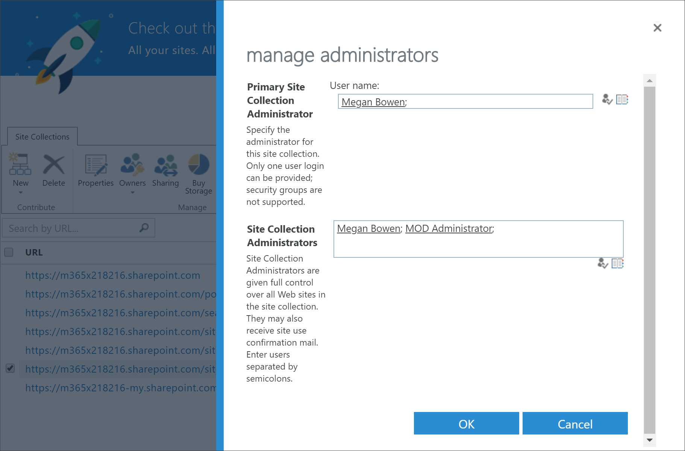
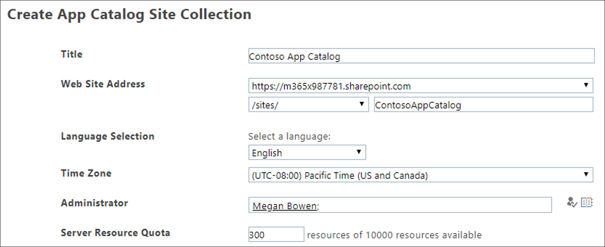

# 疑難排解 Microsoft 365 教學路徑Troubleshoot Microsoft 365 learning pathways

以下是 Microsoft 365 教學路徑或 SharePoint 線上布建服務可能發生之問題的疑難排解提示。Here are troubleshooting tips for problems that may occur with Microsoft 365 learning pathways or the SharePoint Online Provisioning Service.

## 如何知道您是否有承租人系統管理員許可權How to know if you have Tenant Admin permissions

登入 SharePoint 線上布建服務，以及布建自訂學習要求承租人系統管理員許可權。Sign in to the SharePoint Online Provisioning Service and provisioning Custom Learning requires Tenant Admin permissions. 如果您遇到 SharePoint 線上布建服務的登入問題，請確定您已被指派全域系統管理員角色。If you are experiencing sign in issues with the SharePoint Online Provisioning Service, make sure that you have been assigned the Global administrator role. 自訂學習解決方案需要租使用者系統管理員許可權，否則稱為 Office 365 全域系統管理員角色。The Custom Learning solution requires Tenant Admin permissions, otherwise known as Office 365 Global Administrator role. 以下是判斷您是否已被指派全域系統管理員角色的方法。Here’s how to determine if you have been assigned the Global Administrator role.

1.  登入 Office.com。Sign in to Office.com.
2.  按一下 [**管理**]Click **Admin**
3.  在 [**使用者**] 底下，選取 [作用中**使用者**]Under **Users**, select **Active Users**
4.  搜尋您的名稱Search for your name
5.  按一下搜尋結果中的名稱。Click your name in Search results. 您應該會看到全域管理員的角色。You should see Global administrator for your role.

### 如果您沒有全域系統管理員角色If you don’t have the Global administrator role
- 尋找組織中的全域系統管理員，讓該人員登入服務，或讓他們為您指派全域系統管理員角色。Find a Global Administrator in your organization and have that person sign into the service or have them assign the Global administrator role to you.

## 租使用者應用程式目錄疑難排解Tenant App Catalog Troubleshooting
自訂學習需要在目標租使用者中布建應用程式目錄。Custom Learning requires an App Catalog to be provisioned in the target tenant. 建立應用程式目錄需要全域管理員許可權。Creating an app catalog requires Global Administrator permissions. 以下是常見應用程式目錄問題的疑難排解步驟：Here’s are troubleshooting steps for common App Catalog issues:

### 如何知道您是否有租使用者應用程式目錄How to know if you have a Tenant app catalog 
針對初學者，請確定您具有全域管理員許可權。For starters, ensure that you have Global administrator permissions. 請參閱上述租使用者管理員許可權的步驟。See the steps for Tenant Admin permissions above.

1. 從 Office 365，按一下 [**管理**]，按一下展開箭號 >，然後按一下 [**顯示所有**系統  >  **管理中心**]  >  **SharePoint**。From Office 365, click **Admin**, click the expand arrow >, click **Show all** > **Admin centers** > **SharePoint**.
2. 按一下 [**傳統系統管理員 SharePoint 中心**  >  **應用**  >  **程式] 應用程式目錄**。Click **Classic Admin SharePoint Center** > **apps** > **App Catalog**.
3. 在 [ **應用程式**] 底下，您應該會看到一個貼上標題為「 **散佈應用程式 SharePoint**。Under **Apps**, you should see a tile titled **Distribute apps for SharePoint**. 如果您看到的是磚，表示您有租使用者應用程式目錄。If you see the tile, you have a Tenant App Catalog. 請參閱 how **to 確定您的網站 Colllection ...** ] 區段。See the **How to ensure your are a Site Colllection...** section below. 如果您看不到所需的磚，您將需要為您的租使用者建立承租人應用程式目錄。If you don’t see the tile you will need to create a tenant app catalog for your tenant. 請參閱 **如何建立租使用者應用程式目錄** 一節。See the **How to create a Tenant App Catalog** section below .

### 如何確保您是租使用者應用程式目錄上的網站集合擁有者How to ensure you are a Site Collection Owner on the Tenant App Catalog 
若要布建 Microsoft 365 學習路徑，您必須是租使用者應用程式目錄上的網站集合擁有者。To provision Microsoft 365 learning pathways, you will need to be a Site Collection Owner on the Tenant App Catalog. 以下是判斷您是否為擁有者的方式。Here’s how to determine if you are an Owner.

1. 從 Office 365，按一下 [**管理**]，按一下展開箭號 >，然後按一下 [**顯示所有**系統  >  **管理中心**]  >  **SharePoint**。From Office 365, click **Admin**, click the expand arrow >, click **Show all** > **Admin centers** > **SharePoint**.
2. 按一下 [ **傳統 Admin SharePoint Center**]，然後選取 **應用程式目錄**。Click **Classic Admin SharePoint Center**, and then select the **app catalog**.
3. 選取 [ **擁有**者]，然後確定您是網站集合擁有者。Select **Owner**, and then ensure you are a Site Collection Owner. 它看起來應該像這樣。It should look something like this.
 

### 如何建立租使用者應用程式目錄（若有的話）How to create a Tenant App Catalog if one doesn’t exists 
1. 使用您的 SharePoint 線上系統管理員帳戶登入 Office 365。Sign in to Office 365 with your SharePoint Online admin account.
2. 按一下 [ **管理**]。Click **Admin**.
3. 在 [系統 **管理中心**] 底下，按一下 [ **SharePoint**]。Under **Admin centers**, click **SharePoint**. 
4. 按一下 [**應用**  >  **程式應用程式目錄**]。Click **Apps** > **App Catalog**.
5. 按一下 [ **建立新的應用程式目錄網站**]，然後按一下 **[確定]**。Click **Create a new app catalog site**, and then click **OK**. 
6.  輸入應用程式目錄的資訊。Enter the information for the App Catalog. 您可能想要包含一個以上的系統管理員。You may want to include more than one Administrator. 下列範例所示。The following shows an example.  

7.  這樣就完成了。That’s it. 您已經完成。You’re done. 但在您進入自訂教學之前，您至少需要等候30分鐘，確定應用程式目錄建立已完成。But before you move to provisioning Custom Learning, you need to wait at least 30 minutes to make sure the App Catalog creation is complete. 

> [!IMPORTANT]
> 在建立承租人應用程式目錄之後，請至少等候30分鐘，再提供自訂學習。Wait at least 30 minutes after creating the Tenant App Catalog before provisioning Custom Learning. 這可確保應用程式目錄布建程式在 SharePoint 內完成。This ensures that the App Catalog provisioning process is complete within SharePoint. 