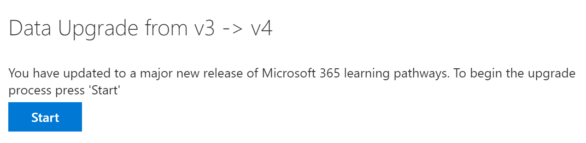

# 更新多語言支援的學習路徑Update learning pathways for multilingual support
如果您有現有的學習路徑網站，您可以更新它以進行多語言支援。If you have an existing Learning Pathways site, you can update it for multilingual support. 若要將學習路徑更新為多語系4.0 版本，請將網頁元件套件（customlearning）上傳至 SharePoint 租使用者目錄。To update learning pathways to the multilingual 4.0 version, you upload the web part package, customlearning.sppkg, to the SharePoint tenant App Catalog. 當您更新學習路徑：When you update learning pathways:  

- 先前建立的任何自訂播放清單和資產都將維護Any previously created custom playlists and assets are maintained
- 會維護隱藏或顯示內容的設定Settings to hide or show content are maintained
- 學習路徑 SharePoint 範本保持不變The learning pathways SharePoint template is left unchanged
- 學習路徑網站頁面不會轉譯。The learning pathways site pages aren't translated. 您必須手動執行這種工作This work must be done manually

## 閱讀學習路徑多語簡介Read the learning pathways multilingual overview
若要瞭解多語系支援如何運作以取得學習路徑，請閱讀 [學習路徑多語言概述](custom_overview_ml.md)) 。To learn about how multilingual support works for learning pathways, read the [Learning pathways multilingual overview](custom_overview_ml.md)). 

## 更新的必要條件Prerequisites to update
更新學習路徑之前，必須符合下列先決條件：Before updating learning pathways, the following prerequisite must be met:
- 更新學習路徑的人員必須是租使用者應用程式目錄的網站集合擁有者。The person updating learning pathways must be a site collection owner of the tenant App Catalog. 如果人員提供的學習路徑不是應用程式目錄的網站集合擁有者，請 [完成這些指示](addappadmin.md) 並繼續。If the person provisioning learning pathways isn't a site collection owner of the App Catalog, [complete these instructions](addappadmin.md) and continue. 

## 設定語言設定Set language settings 
在更新學習路徑之前，請先設定網站的語言設定。Before updating learning pathways, set the site language settings. 若要啟用「學習路徑」網站的多語系支援，您可以將 [ **啟用頁面和新聞] 的 [可轉譯成多種語言** ] 設定為 [ **開啟**]，然後新增您要支援的網站語言。To enable multilingual support for the learning pathways site, you can set the **Enable pages and news to be translated into multiple languages** to **On**, and then add the languages you want to support for the site.
1.  在 [學習路徑] 網站中，從右上方選取 [ **設定** ]，然後選取 [ **網站資訊**]。From the Learning Pathways site, select **Settings** from the top right, and then select **Site information**.
2.  在 [網站資訊] 窗格的底部，選取 [ **查看所有網站設定**]。At the bottom of the site information pane, select **View all site settings**.
3.  在 [ **網站管理**] 下，選取 [ **語言設定**]。Under **Site Administration**, select **Language settings**.
4.  在 [ **讓頁面和新聞可轉譯成多種語言**] 底下，設定切換參數。Under **Enable pages and news to be translated into multiple languages**, set the toggle switch. 
- 針對 multiligual 網站，將切換滑動至 [ **開啟**]，然後繼續進行 [新增語言] 區段。For a multiligual site, slide the toggle to **On**, and then proceed to the Add Languages section. 
- 若為僅供英文使用的網站，請將此開關滑動至 [ **關閉**]。For an English-only site, slide the toggle to **Off**.

### 新增語言Add languages
學習路徑支援九種語言，您應該只新增您需要的語言。Learning pathways supports nine languages, you should add only the languages you need. 在本檔中所使用的範例中，會新增義大利文。In the examples used in this documentation, Italian will be added. 
- 在 [ **新增或移除網站語言**] 底下，開始在 [ **選取] 或 [輸入語言**] 中輸入語言名稱，或從下拉式清單中選擇語言。Under **Add or remove site languages**, start typing a language name in **Select or type a language**, or choose a language from the dropdown. 您可以重複此步驟來新增多種語言。You can repeat this step to add multiple languages. 您可以隨時在網站中新增或移除語言，只要回到此頁面。You can add or remove languages from your site at any time by going back to this page.
 
### 指派翻譯員Assign translators
在定義學習路徑的語言設定時，您可以指派翻譯人員。When defining Language settings for learning pathways, you can assign translators. 翻譯員應設定外部語言設定檔。Translators should have a foreign language profile set up. 如需外國語言設定檔的詳細資訊，請參閱 [建立多語言通訊網站、頁面和新聞](https://support.office.com/article/2bb7d610-5453-41c6-a0e8-6f40b3ed750c)。For more information about foreign language profiles, see [Create multilingual communication sites, pages, and news](https://support.office.com/article/2bb7d610-5453-41c6-a0e8-6f40b3ed750c).  
- 如需支援的語言，請按一下 [ **選取或輸入翻譯工具** ]，然後選取翻譯工具。For a supported language, click **Select or type a translator** and then select a translator. 

## 更新「學習路徑」網頁元件套件Update the learning pathways web part package
在這個步驟中，您會將「學習路徑4.0」網頁元件上傳至 SharePoint 的應用程式目錄，然後流覽至 [學習路徑管理] 頁面，以啟動更新程式。In this step, you upload the learning pathways 4.0 web part to the SharePoint App Catalog, and then navigate to the learning pathways Administration page to start the update process.

### 上傳網頁元件套件Upload the web part package
1.  移至 [GitHub 自訂學習存放庫](https://github.com/pnp/custom-learning-office-365/tree/master/webpart)，選取 [ **customlearning** ]，然後將其下載至電腦上的本機磁片磁碟機。Go to the [GitHub custom learning repository](https://github.com/pnp/custom-learning-office-365/tree/master/webpart), select **customlearning.sppkg** and then download it to a local drive on your PC. 
2.  如果您尚未登入，請使用租用戶系統管理員或網站集合系統管理員帳戶登入您的租用戶。If you’re not already signed in, sign into your tenant with a Tenant Admin or Site Collection Admin account. 
3.  按一下 [系統 **管理**] [  >  **顯示所有**  >  **SharePoint**  >  **其他功能**]。Click **Admin** > **Show All** > **SharePoint** > **More Features**. 
4.  在 [ **應用程式**] 下，按一下 [ **開啟**]。Under **Apps**, click **Open**. 
5.  按一下 [**應用程式目錄**  >  **分配應用程式以供 SharePoint**。Click **App Catalog** > **Distribute Apps for SharePoint**. 
6.  按一下 [**上傳**  >  **選擇** 檔案]。Click **Upload** > **Choose Files**. 
7.  選取您下載的 **customlearning** 檔，按一下 **[確定**  >  **部署**]。Select the **customlearning.sppkg** file you downloaded, click **OK** > **Deploy**. 

### 完成更新Complete the update
1.  從 [學習路徑] 網站的 [**首頁**] 功能表中，選取 [**學習路徑管理**]。From the Learning Pathways site, select **Learning pathways administration** from the **Home** menu. 
2.  您會看到提示，詢問您是否要更新。You’ll see a prompt asking if you want to update. 

3.  按一下 **[開始]**。Click **Start**. 
4. 更新完成時，按一下 [ **關閉**]。When the update is complete, click **Close**. 

### 後續步驟Next Steps
- 探索網站和網頁元件中提供的 [預設內容](custom_exploresite.md) 。Explore the [default content](custom_exploresite.md) provided in the site and web part.
- 如需翻譯網站頁面的詳細資訊，請參閱 [翻譯網站頁面](custom_translate_page_ml.md)。For more information about translating site pages, see [Translate site pages](custom_translate_page_ml.md). 

