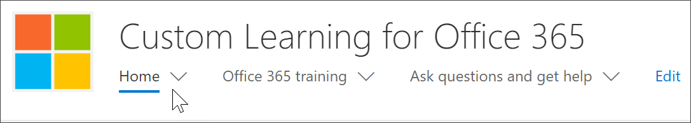

# Microsoft 365 學習路徑網頁組件在哪裡？ 

在組織中布建學習路徑時，會將「學習路徑」網站和網頁元件新增至組織的 SharePoint 租使用者。 在布建過程中，Microsoft 365 學習網頁元件會新增至 Microsoft 365 學習路徑網站的下列頁面：

- Start-with-Six-Simple-Steps .aspx 
- Recommended-Playlists .aspx
- 開始使用-Office 365
- Get-started-with-Microsoft-Teams .aspx
- Get-started-with-OneDrive .aspx
- Get-started-with-SharePoint .aspx
- 學習路徑管理員成功中心 .aspx

針對每個頁面，網頁元件會以不同方式設定，以顯示設計用來支援頁面目的的類別、子類別、播放清單或資產。 [學習路徑] 網頁元件將在稍後的區段中示範，您可以新增至任何 SharePoint 頁面並篩選，以顯示特定類別、子類別、播放清單或僅限資產。 讓我們看看。 

## 查看 Microsoft 團隊播放清單

以下是「 **Microsoft 小組入門** 」頁面的範例，其中包含已篩選的網頁元件，可顯示小組的學習播放清單。 

- 從 [學習路徑] 首頁中，選取 [ **開始使用 Microsoft 小組**]。

- 按一下 [學習路徑] 網站功能表上的 [ **首頁** ] 功能表，以回到 [網站] 首頁。

## 查看六個簡單的步驟播放清單

**Start-with-Six-Simple-Steps** 頁面上的網頁元件會設定為顯示六個簡單步驟播放清單中的第一個資產。 

- 從 [學習路徑] 首頁，按一下 [ **從六個簡單的步驟開始**]。 
![Office 365 頁面，您可以從六個簡單的步驟選取 [開始]。](media/cg-whereiswp-six.png)

## 流覽所有 Microsoft 365 訓練

**Microsoft 365 訓練** 頁面上的網頁元件會設定為顯示「學習路徑」目錄中所有可用的類別和子類別。 這包括來自 Microsoft 的子類別，以及您為組織建立的任何子類別。

- 從 [學習路徑] 首頁，按一下 [ **Microsoft 365 訓練**]。 隨即出現頁面，並將網頁元件設定為顯示自訂學習目錄中所有的類別和子類別。
![顯示類別的 [路徑] 視窗。](media/cg-whereiswp-o365.png)

- 按一下 [學習路徑] 網站功能表上的 [ **首頁** ] 功能表，以回到 [網站] 首頁。

## 在 [系統管理成功中心] 頁面上查看網頁元件

「系統 **管理員成功中心** 」頁面上的網頁元件會設定為篩選系統管理員成功中心所有可用的播放清單。 如下列範例所示，網頁元件會新增至包含系統管理員資源快速連結的頁面。 

- 從 [學習路徑] 首頁，按一下 **[開始使用系統管理員成功中心**]。 按鈕。 

- 按一下 [學習路徑] 網站功能表上的 [ **首頁** ] 功能表，以回到 [網站] 首頁。

