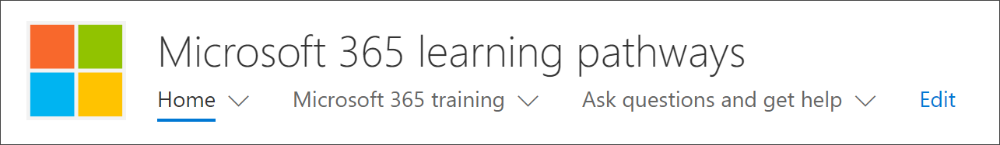

# Microsoft 365 學習路徑的所在網頁組件？Where's the Microsoft 365 learning pathways web part?

當您組織中佈建學習路徑時，租用戶網站和網頁組件新增至貴組織的 SharePoint 學習路徑。When learning pathways is provisioned in your organization, the learning pathways site and web part are added to your organization’s SharePoint tenant. 佈建的一部分，Microsoft 365 學習網頁組件新增至下列頁面的 Microsoft 365 學習路徑網站：As part of the provisioning, the Microsoft 365 learning web part is added to the following pages of the Microsoft 365 learning pathways site:

- 開始-與-6-簡單-Steps.aspxStart-with-Six-Simple-Steps.aspx 
- 建議 Playlists.aspxRecommended-Playlists.aspx
- 取得開始使用 Office 365 aspxGet-started with-Office 365.aspx
- Get-啟動-與-Microsoft-Teams.aspxGet-started-with-Microsoft-Teams.aspx
- Get-啟動-與-OneDrive.aspxGet-started-with-OneDrive.aspx
- Get-啟動-與-SPO.aspxGet-started-with-SPO.aspx

每一頁中，網頁組件是以不同方式來顯示的類別、 子類別、 播放清單或資產設計用來支援] 頁面上之目的的設定。For each page, the Web part is configured differently to show the categories, subcategories, playlists or asset designed to support the intent of the page. 學習路徑網頁組件中，我們將顯示後面章節中，可以被新增至任何 SharePoint] 頁面上，並篩選要顯示特定所有的類別，] 或 [子類別，播放清單，或只資產。The learning pathways web part, as we’ll show you in later sections, can be added to just about any SharePoint page and filtered to show specific all categories, or subcategories, playlists, or just assets. 讓我們看看。Let's take a look. 

## 檢視 Microsoft Teams 播放清單View Microsoft Teams playlists

以下是**開始使用 Microsoft Teams**小組顯示學習播放清單篩選網頁組件頁面的範例。Here’s an example of the **Get Started with Microsoft Teams** page with the Web part filtered to show the learning playlists for Teams. 

- 從學習路徑的首頁] 頁面上，選取**要開始使用 Microsoft Teams**。From the learning pathways Home page, select **Get started with Microsoft Teams**.

- 按一下 [**首頁**] 功能表上的學習路徑網站回到網站首頁上的功能表。Click the **Home** menu on the learning pathways site menu to return to the site Home page.

## 檢視六個簡單的步驟播放清單View the Six Simple Steps playlist

**開始-與-6-簡單-Steps.aspx**頁面網頁組件已設定為六個簡單的步驟播放清單中顯示的第一個資產。The web part on the **Start-with-Six-Simple-Steps.aspx** page is configured to show the first asset in the Six Simple Steps playlist. 

- 從學習路徑的首頁] 頁面上，按一下 [**開始使用六個簡單的步驟**。From the learning pathways Home page,  click **Start with six simple steps**. 

## 檢視所有 Office 365 訓練View all Office 365 training

在**Office 365 訓練**] 頁面上的網頁組件設定為顯示所有類別和子類別提供從學習路徑目錄。The Web part on the **Office 365 training** page is configured to show all the categories and subcategories available from the learning pathways catalog. 這包括來自 Microsoft 的子類別，以及您為組織建立任何子類別。This includes subcategories from Microsoft along with any subcategories that you create for your organization.

- 學習路徑的首頁] 頁面上，按一下 [ **Office 365 訓練**。From the learning pathways Home page, click **Office 365 training**. 出現 [] 頁面會出現在網頁組件以顯示所有類別和子類別提供從自訂學習目錄設定。The page appears appears with the Web part configured to show all the categories and subcategories available from the Custom Learning catalog.

- 按一下 [**首頁**] 功能表上的學習路徑網站回到網站首頁上的功能表。Click the **Home** menu on the learning pathways site menu to return to the site Home page.

