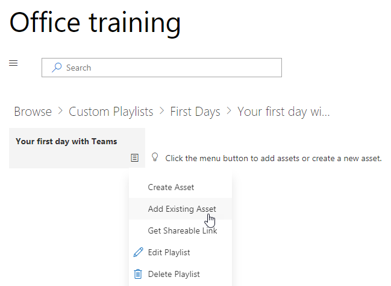

# 自訂 [服務] 和 [播放清單

預設的網站經驗及網頁組件包含所有的 Office 365 服務的內容。 如果只全部或部分這些服務會提供您的公司您可以調整內容可供您的使用者。 本文中我們將自訂的網頁組件內容。  

## 自訂網頁組件內容

自訂學習網頁組件提供兩個主要特色：
- 隱藏顯示技術
- 建立播放清單

### 隱藏或顯示技術類別

若要隱藏並顯示 [網頁組件中的內容： 
1.  按一下下拉式清單功能表上的網頁組件，然後按一下 [隱藏/顯示技術

2. 選取 [checkox 隱藏或顯示技術並選取 [**套用**]。

### 建立播放清單

播放清單是 compliation 的"資產"。"資產"是 SharePoint] 頁面上或現有的 Microsoft 訓練內容的項目。當您建立播放清單選取 [一起移出資產建立學習路徑為您的使用者。  

新增 SharePoint 頁面的優點是您可以建立 SharePoint 頁面與 YouTube 影片或裝載您組織中的影片。您也可以建立與表單或其他 Office 365 內容的頁面。  

#### 步驟 1： 建立 SharePoint 頁面播放清單
在這個範例中，我們將第一次建立 SharePoint 頁面新增至播放清單。我們將建立頁面與 YouTube 影片的網頁組件和文字網頁組件。 這些指示假設您已使用 SharePoint Online 服務。 

#### 建立新的頁面
1.  選取 [設定] 功能表 > 網站內容 > 網站頁面 > 新 > 網站] 頁面。
2.  在 [標題] 區域中，輸入使用小組命令方塊
3.  選取 [新增] 新增區段，然後選取 [兩欄。

4.  在 [左] 方塊中，選取 [新增新的網頁組件，然後選取 Embed。 
5.  在網頁瀏覽器中移至這個 URLhttps://youtu.be/wYrRCRphrp0及取得內嵌程式碼的影片。 
6.  在 SharePoint 網頁組件中，選取新增內嵌程式碼，然後將它貼到 [內嵌] 方塊中。 
7.  在右側的方塊中，選取 [新增新的網頁組件，然後選取的文字。 
8.  在網頁瀏覽器中移至這個 URL:https://support.office.com/en-us/article/13c4e429-7324-4886-b377-5dbed539193b並複製 Try 它 ！從 [] 頁面上的指示並將其貼到文字網頁組件。您] 頁面上看起來應該類似如下。 

9.  [發佈]，然後複製頁面的 URL 並將其貼在 [記事本]

#### 步驟 2： 建立播放清單
1.  瀏覽至您安裝自訂學習網頁組件。在完整的網站經驗它架設在 Office 365 訓練] 頁面上。 
2.  從下拉式清單功能表選取 [建立新的播放清單。 

3.  下面的範例所示的值填滿並選取 [**建立**。 

#### 步驟 3： 將資產新增至播放清單
在此步驟中，您將從 Microsoft 和您建立 [SharePoint] 頁面上新增現有的資產至播放清單。 

1.  按一下 [功能表] 按鈕，然後按一下 [新增現有的資產。

2.  篩選 Office 365 應用程式 > 的 Microsoft 小組訓練
3.  將歡迎使用新增至 Microsoft 小組、 取得您的小組啟動並執行，並啟動聊天並進行的通話。
4.  選取 [功能表] 按鈕 > 建立資產。
5.  使用資產的標題] 方塊中選取 [小組命令] 方塊中類型。 
6.  SharePoint 使用貼上複製資產的內容] 欄位中的小組命令] 方塊中頁面 URL。 
7.  現在瀏覽回至首頁 > 自訂播放清單 > 您第一天小組 > 與使用 [小組命令] 方塊中。您] 頁面上看起來應該類似如下。 

使用此內容播放清單現在會提供任何位置有安裝 / 內嵌自訂學習網頁組件。 

#### 需考慮的事項

自訂播放清單可用來協助您的使用者 vareity 的工作。 您必須關閉要求表單的時間吗？ 若要要求硬體設備表單？ 任何現有的訓練資產可編寫成使用經驗。  
