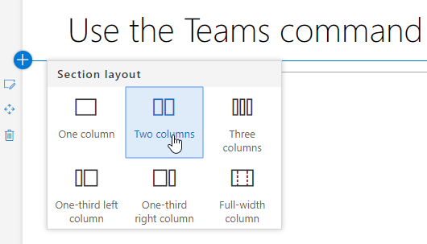
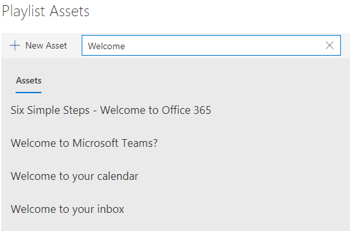
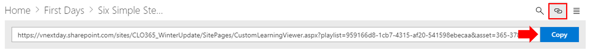

# 自訂及共用播放清單Customize and Share Playlists

## 建立播放清單Create a Playlist

播放清單是 compliation 的"資產"。"資產"是 SharePoint] 頁面上或現有的 Microsoft 訓練內容的項目。當您建立播放清單選取 [一起移出資產建立學習路徑為您的使用者。A playlist is a compliation of "assets". An "asset" is a SharePoint page or existing item of Microsoft training content. When you create a playlist you select assets that go together to create a learning path for your user.  

新增 SharePoint 頁面的優點是您可以建立 SharePoint 頁面與 YouTube 影片或裝載您組織中的影片。您也可以建立與表單或其他 Office 365 內容的頁面。The benefit of adding SharePoint pages is that you can create SharePoint pages with a YouTube videos or videos hosted in your organization. You can also create pages with Forms or other Office 365 content.  

#### 步驟 1： 建立 SharePoint 頁面播放清單Step 1: Create a SharePoint page for your playlist
在這個範例中，我們將第一次建立 SharePoint 頁面新增至播放清單。我們將建立頁面與 YouTube 影片的網頁組件和文字網頁組件。 這些指示假設您已使用 SharePoint Online 服務。In this example, we’ll first create a SharePoint page to add to the playlist. We’ll create a page with a YouTube video web part and Text web part.  These instructions assume you are using the SharePoint Online service. 

#### 建立新的頁面Create a new page
1.  選取 [設定] 功能表 > 網站內容 > 網站頁面 > 新 > 網站] 頁面。Select the Settings menu > Site Contents > Site Pages > New > Site Page.
2.  在 [標題] 區域中，輸入使用小組命令方塊In the title area, type Use the Teams command box
3.  選取 [新增] 新增區段，然後選取 [兩欄。Select the Add a new section, and then select Two Columns.

4.  在 [左] 方塊中，選取 [新增新的網頁組件，然後選取 Embed。In the left-hand box, select Add a new web part, and then select Embed. 
5.  在網頁瀏覽器中移至這個 URLhttps://youtu.be/wYrRCRphrp0及取得內嵌程式碼的影片。In a Web browser, go to this URL https://youtu.be/wYrRCRphrp0 and get the embed code for the video. 
6.  在 SharePoint 網頁組件中，選取新增內嵌程式碼，然後將它貼到 [內嵌] 方塊中。In the SharePoint Web part, select Add Embed code and then paste it into the Embed box. 
7.  在右側的方塊中，選取 [新增新的網頁組件，然後選取的文字。In the right-hand box, select Add a new web part, and then select Text. 
8.  在網頁瀏覽器中移至這個 URL:https://support.office.com/en-us/article/13c4e429-7324-4886-b377-5dbed539193b並複製 Try 它 ！從 [] 頁面上的指示並將其貼到文字網頁組件。您] 頁面上看起來應該類似如下。In a Web browser, go to this URL: https://support.office.com/en-us/article/13c4e429-7324-4886-b377-5dbed539193b and copy the Try it! Instructions from the page and paste them into the Text Web part. Your page should look like the following. 

9.  [**發佈**]，然後複製頁面的 URL 並將其貼在 [記事本]Click **Publish**, and then copy the URL of the page and paste it in Notepad

#### 步驟 2： 建立播放清單Step 2: Create the Playlist

1. 瀏覽至 [**自訂學習管理**頁面的網站經驗。Navigate to the **Custom Learning Administration** page in your site experience. 
1. 請確定已選取**類別**Make sure **Category** is selected 
1. 按一下 [在您要用來顯示您新播放清單的類別Click on the category where you'd like your new playlist to appear
1. 類別名稱旁，按一下加號符號Next to the category name, click on the plus symbol 

1. 下面的範例所示的值填滿並選取 [**建立**。Fill in the values as shown in the example below and select **Create**. 
- **標題**播放清單的顯示名稱**Title** - Display name of the playlist
- **描述**項目會學到的資訊**Description** - Information about what will be learned
- **類別**-預先選取根據初始的選取範圍**Category** - Preselected based on your initial selection
- **子類別**-預先選取根據 intial 選取項目**Sub Category** - Preselected based on your intial selection
- **技術**-選取視情況**Technology** - Select as applicable
- **層級**初級、 Intermidate 或進階**Level** - Beginner, Intermidate or Advanced
- **對象**-這可讓您根據預先定義的角色 Microsoft 提供的清單設定內容目標。**Audience** - This allows you to target content based on a pre-defined list of roles provided by Microsoft.

6. 按一下 [**儲存] 詳細資料**Click **Save Detail**

> [!TIP]
> 您可以在播放清單的自訂圖示影像。 按一下 [圖像] 圖示並插入先前上傳圖像的 URL。 請確定映像所在自訂學習網站集合內或其他所有使用者都必須存取檔案的位置。You can customize the icon image for your playlist.  Click the image icon and insert an URL of a previously uploaded image.  Make sure the image is located within the Custom Learning site collection or in another location that all users will have access to the file.  

#### 步驟 3： 將資產新增至播放清單Step 3: Add assets to the playlist
在此步驟中，您將從 Microsoft 和您建立 [SharePoint] 頁面上新增現有的資產至播放清單。In this step, you’ll add existing assets from Microsoft and the SharePoint page you created to the playlist. 

1. 一旦您已儲存的詳細資訊的播放清單您可以使用現有的資產的搜尋。Once you have saved the details for your Playlist you can use the Search for Existing Assets.
1. 若要查看預先定義的資產提供的其他播放清單的清單**輸入的任何搜尋字詞**。**名稱上按一下 [** 加入新的播放清單中資產。**Enter in any search term** to see a list of predefined assets that are available from other playlists. **Click on the name** of an asset to include it in your new playlist. 

您也可以新增您稍早所建立或建立 web 應用程式從頭經驗中的 [SharePoint] 頁面。You can also add the SharePoint page you created earlier or create one from scratch in the experience.

1. 按一下 [播放清單資產] 對話方塊中的 [**新的資產**] 選項Click on the **New Asset** option in the Playlist Assets dialog
1. 讓您資產的**標題**。一旦輸入，將會顯示其他選項Give your asset a **Title**. Once entered, additional options will display 
1. 您現在可以在 SharePoint Online 中建立新的資產] 頁面上或輸入現有的頁面的 URL 新增至您的自訂播放清單中。You can now create a new asset page in SharePoint Online or enter in the URL of an existing page to add it to your custom playlist. 
1. 會根據此播放清單您先前的選擇預先填入資料**類別**、**子類別**及**技術**] 欄位。**Category**, **Sub Category** and **Technology** fields will be pre-populated based on your previous selections for this playlist.
1. 讓此個別資產層級及對象選取適當的選項。Make the appropriate selections for Level and Audience for this individual asset.  
1. 按一下 [**儲存資產**將它新增至自訂播放清單Click **Save Asset** to add it to the custom playlist
1. 重複這些步驟，[搜尋] 或 [新增個別頁面，直到您播放清單已完成。Repeat these steps, either searching or adding individual pages, until your playlist is complete. 
1. 按一下 [**關閉播放清單**以儲存Click **Close Playlist** to save

使用此內容播放清單現在會提供任何位置有安裝 / 內嵌自訂學習網頁組件。Your playlist with this content will now be available anywhere you have installed / embedded the Custom Learning webpart. 

> [!NOTE]
> 如果您進行錯誤在關閉播放清單之後，您可以從類別刪除按一下 [X] 旁的播放清單名稱。If you make a mistake once you have closed the playlist, you can delete it from the category by clicking the X next to the playlist name.  

#### 需考慮的事項Things to Think About

自訂播放清單可用來協助您的使用者在各種工作。 您必須關閉要求表單的時間吗？ 若要要求硬體設備表單？ 任何現有的訓練資產可編寫成使用經驗。Custom playlists can be used to assist your end users in a variety of tasks.  Do you have a time off request form?  A form to request hardware equipment?  Any existing training assets can be programmed into the experience.  

## 共用播放清單Share Playlists

1. 瀏覽至 [網頁組件或網站體驗內任何播放清單Navigate to any playlist within the webpart or site experience
1. 在左上角您會看到三個圖示In the upper left hand corner you will see three icons
1. 代表連結的圖示上按一下 [Click on the icon representing a link
1. 將 URL 複製到播放清單Copy the URL to the playlist

至此 URL 可以立即插入您的網站瀏覽窗格中或在此才會直接至該播放清單員工其他通訊中使用。 This URL can now be inserted in your site navigation or utilized in other communications to take your employees directly to that playlist. 

### 後續步驟-[磁碟機採用](driveadoption.md)Next Steps - [Drive Adoption](driveadoption.md)
