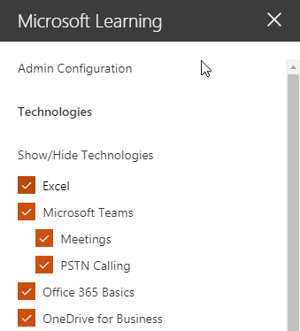

# 自訂 [服務] 和 [播放清單Customize the Services and Playlists

預設的網站經驗及網頁組件包含所有的 Office 365 服務的內容。 如果只全部或部分這些服務會提供您的公司您可以調整內容可供您的使用者。 本文中我們將自訂的網頁組件內容。By default both the site experience and the webpart include content for all Office 365 services.  If only all or some of these services are available in your company you can adjust what content is available to your users.  In this article we will customize the webpart content.  

## 自訂網頁組件內容Customizing the webpart content

自訂學習網頁組件提供兩個主要特色：The Custom Learning webpart provides two key features:
- 隱藏顯示技術Hide/Show Technologies
- 建立播放清單Create a Playlist

### 隱藏或顯示技術類別Hide or Show Technology Categories

若要隱藏並顯示 [網頁組件中的內容：To hide and show content in the Web part: 
1.  按一下下拉式清單功能表上的網頁組件，然後按一下 [隱藏/顯示技術Click the dropdown menu on the webpart, then click Hide/Show Technologies

2. 選取 [checkox 隱藏或顯示技術並選取 [**套用**]。Select a checkox to hide or show a technology and select **Apply**.

### 建立播放清單Create a Playlist

播放清單是 compliation 的"資產"。"資產"是 SharePoint] 頁面上或現有的 Microsoft 訓練內容的項目。當您建立播放清單選取 [一起移出資產建立學習路徑為您的使用者。A playlist is a compliation of "assets". An "asset" is a SharePoint page or existing item of Microsoft training content. When you create a playlist you select assets that go together to create a learning path for your user.  

新增 SharePoint 頁面的優點是您可以建立 SharePoint 頁面與 YouTube 影片或裝載您組織中的影片。您也可以建立與表單或其他 Office 365 內容的頁面。The benefit of adding SharePoint pages is that you can create SharePoint pages with a YouTube videos or videos hosted in your organization. You can also create pages with Forms or other Office 365 content.  

#### 步驟 1： 建立 SharePoint 頁面播放清單Step 1: Create a SharePoint page for your playlist
在這個範例中，我們將第一次建立 SharePoint 頁面新增至播放清單。我們將建立頁面與 YouTube 影片的網頁組件和文字網頁組件。 這些指示假設您已使用 SharePoint Online 服務。In this example, we’ll first create a SharePoint page to add to the playlist. We’ll create a page with a YouTube video web part and Text web part.  These instructions assume you are using the SharePoint Online service. 

#### 建立新的頁面Create a new page
1.  選取 [設定] 功能表 > 網站內容 > 網站頁面 > 新 > 網站] 頁面。Select the Settings menu > Site Contents > Site Pages > New > Site Page.
2.  在 [標題] 區域中，輸入使用小組命令方塊In the title area, type Use the Teams command box
3.  選取 [新增] 新增區段，然後選取 [兩欄。Select the Add a new section, and then select Two Columns.

4.  在 [左] 方塊中，選取 [新增新的網頁組件，然後選取 Embed。In the left-hand box, select Add a new web part, and then select Embed. 
5.  在網頁瀏覽器中移至這個 URLhttps://youtu.be/wYrRCRphrp0及取得內嵌程式碼的影片。In a Web browser, go to this URL https://youtu.be/wYrRCRphrp0 and get the embed code for the video. 
6.  在 SharePoint 網頁組件中，選取新增內嵌程式碼，然後將它貼到 [內嵌] 方塊中。In the SharePoint Web part, select Add Embed code and then paste it into the Embed box. 
7.  在右側的方塊中，選取 [新增新的網頁組件，然後選取的文字。In the right-hand box, select Add a new web part, and then select Text. 
8.  在網頁瀏覽器中移至這個 URL:https://support.office.com/en-us/article/13c4e429-7324-4886-b377-5dbed539193b並複製 Try 它 ！從 [] 頁面上的指示並將其貼到文字網頁組件。您] 頁面上看起來應該類似如下。In a Web browser, go to this URL: https://support.office.com/en-us/article/13c4e429-7324-4886-b377-5dbed539193b and copy the Try it! Instructions from the page and paste them into the Text Web part. Your page should look like the following. 

9.  [發佈]，然後複製頁面的 URL 並將其貼在 [記事本]Click Publish, and then copy the URL of the page and paste it in Notepad

#### 步驟 2： 建立播放清單Step 2: Create the Playlist
1.  瀏覽至您安裝自訂學習網頁組件。在完整的網站經驗它架設在 Office 365 訓練] 頁面上。Navigate to where you have installed the Custom Learning webpart. In the full site experience it is hosted on the Office 365 training page. 
2.  從下拉式清單功能表選取 [建立新的播放清單。From the dropdown menu select Create New Playlist. 

3.  下面的範例所示的值填滿並選取 [**建立**。Fill in the values as shown in the example below and select **Create**. 

#### 步驟 3： 將資產新增至播放清單Step 3: Add assets to the playlist
在此步驟中，您將從 Microsoft 和您建立 [SharePoint] 頁面上新增現有的資產至播放清單。In this step, you’ll add existing assets from Microsoft and the SharePoint page you created to the playlist. 

1.  按一下 [功能表] 按鈕，然後按一下 [新增現有的資產。Click the menu button, then click Add Existing Asset.

2.  篩選 Office 365 應用程式 > 的 Microsoft 小組訓練Filter on Office 365 Apps > Microsoft Teams Training
3.  將歡迎使用新增至 Microsoft 小組、 取得您的小組啟動並執行，並啟動聊天並進行的通話。Add Welcome to Microsoft Teams, Get your team up and running, and Start chats and make calls.
4.  選取 [功能表] 按鈕 > 建立資產。Select the menu button > Create Asset.
5.  使用資產的標題] 方塊中選取 [小組命令] 方塊中類型。Type Use the Teams command box in the Asset title box. 
6.  SharePoint 使用貼上複製資產的內容] 欄位中的小組命令] 方塊中頁面 URL。Paste the SharePoint Use the Teams command box page URL you copied in the Asset content field. 
7.  現在瀏覽回至首頁 > 自訂播放清單 > 您第一天小組 > 與使用 [小組命令] 方塊中。您] 頁面上看起來應該類似如下。Now navigate back to the Home Page > Custom Playlists > Your first days with Teams > Use the Teams command box. Your page should look like the following. 

使用此內容播放清單現在會提供任何位置有安裝 / 內嵌自訂學習網頁組件。Your playlist with this content will now be available anywhere you have installed / embedded the Custom Learning webpart. 

#### 需考慮的事項Things to Think About

自訂播放清單可用來協助您的使用者 vareity 的工作。 您必須關閉要求表單的時間吗？ 若要要求硬體設備表單？ 任何現有的訓練資產可編寫成使用經驗。Custom playlists can be used to assist your end users in a vareity of tasks.  Do you have a time off request form?  A form to request hardware equipment?  Any existing training assets can be programmed into the experience.  
