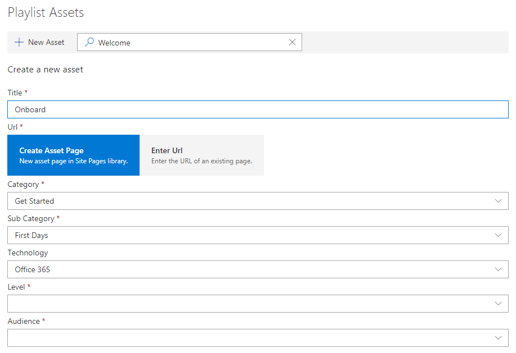

# 自訂及共用播放清單

## 建立播放清單

播放清單是 compliation 的 「 資產 」。 「 資產 」 是指 SharePoint] 頁面上或 Microsoft 訓練內容的現有項目。 當您建立播放清單可選取相近的資產建立學習路徑為您的使用者。  

新增 SharePoint 網頁的好處是，您可以建立 SharePoint 網頁與 YouTube 視訊或裝載在組織中的影片。 您也可以建立頁面與表單或其他 Office 365 內容。  

#### 步驟 1： 建立 SharePoint 頁面播放清單
在這個範例中，我們會先建立 SharePoint 頁面新增至播放清單。 我們將建立頁面 YouTube 視訊網頁組件和文字網頁組件。  這些指示假設您正使用 SharePoint Online 服務。 

#### 建立新的頁面
1.  選取 [設定] 功能表 > 網站內容 > 網站頁面 > 新 > 網站] 頁面。
2.  在 [標題] 區域中，輸入使用 Teams 的命令] 方塊中
3.  選取 [將新區段，，然後選取 [兩個資料行。

4.  在 [左] 方塊中，選取 [新增新的網頁組件，，，然後選取 [內嵌]。 
5.  在網頁瀏覽器中，前往 [此 URL https://youtu.be/wYrRCRphrp0 ，並取得內嵌程式碼的影片。 
6.  中的 SharePoint 網頁組件中，選取 [新增內嵌程式碼，然後將它貼到 [內嵌] 方塊中。 
7.  在右側的方塊中，選取 [新增新的網頁組件]，然後選取的文字。 
8.  在網頁瀏覽器中，前往 [此 URL: https://support.office.com/en-us/article/13c4e429-7324-4886-b377-5dbed539193b ，然後複製 [試它 ！ 從 [] 頁面上的指示並將它們貼到文字網頁組件。 您的頁面看起來應該如下所示。 

9.  按一下 [**發佈**]，然後複製頁面的 URL，並將它貼在 [記事本]

#### 步驟 2： 建立播放清單

1. 瀏覽至 [**自訂學習管理**頁面的網站經驗。

1. 請確定已選取**類別** 
1. 按一下您想要顯示新的播放清單的類別
1. 類別名稱旁，按一下加號

1. 下列範例所示的值填滿，選取 [**建立**。 

- **標題**-播放清單的顯示名稱
- **描述**-學習內容的資訊
- **分類**-預先選取根據您的初始選取範圍
- **子類別**-預先選取根據您的初始選取範圍
- **技術**-選取適用
- **層級**-初學者，Intermidate 或進階
- **對象**-這可讓您根據預先定義的 Microsoft 所提供的角色清單設定內容目標。

6. 按一下 [**儲存] 詳細資料**

> [!TIP]
> 您可以自訂圖示影像播放清單。  按一下 [圖像] 圖示，然後插入先前上傳影像 URL。  請確定影像是位於內自訂學習網站集合或所有使用者，就都可以存取檔案的另一個位置中。  

#### 步驟 3： 新增資產的播放清單
在此步驟中，您會將現有的資產從 Microsoft 和您所建立的 SharePoint 網頁新增至播放清單。 

1. 一旦您已儲存的詳細資訊播放清單您可以使用現有的資產的搜尋。
1. 若要查看的預先定義的資產，均可在其他播放清單**輸入在任何搜尋字詞**。 **名稱上按一下 [** 加入新播放清單中的資產。

您也可以新增您稍早所建立，或建立一個從頭經驗中的 [SharePoint] 頁面。

1. 按一下 [播放清單資產] 對話方塊中的 [**新的資產**] 選項
1. 可讓您資產**標題**。 在輸入後，將顯示額外選項
1. 您現在可以 SharePoint Online 中建立新的資產] 頁面上，或將它新增至自訂播放清單的現有頁面的 URL 中輸入。 
1. 會根據您先前的選擇，此播放清單的預先填入資料**分類**、**子類別**和**技術**] 欄位。
1. 讓此個別資產層級和對象選取適當的選項。  
1. 按一下 [**儲存資產**將它新增至自訂播放清單
1. 重複這些步驟中，[搜尋] 或 [新增個別的頁面，直到您播放清單已完成。 
1. 按一下 [**關閉播放清單**以儲存

此內容與播放清單現在可隨處您已安裝 / 內嵌自訂學習網頁組件。 

> [!NOTE]
> 如果您犯一旦關閉了播放清單，您可以從類別刪除按一下 x 播放清單名稱旁的欄位。  

#### 需考慮的事項

自訂播放清單可用來協助您的使用者在不同的工作。  您必須關閉要求表單的時間？  若要要求硬體設備表單？  任何現有的訓練資產可以設計成體驗。  

## 共用播放清單

1. 瀏覽至任何播放清單內的網頁組件或網站體驗
1. 在左上角中，您會看到三個圖示
1. 按一下 [上一個連結的圖示
1. 將 URL 複製到播放清單

此 URL 可以立即在網站導覽中插入或在其他通訊才會直接與該播放清單員工中利用。 

### 接下來的步驟-[推動採用](driveadoption.md)
