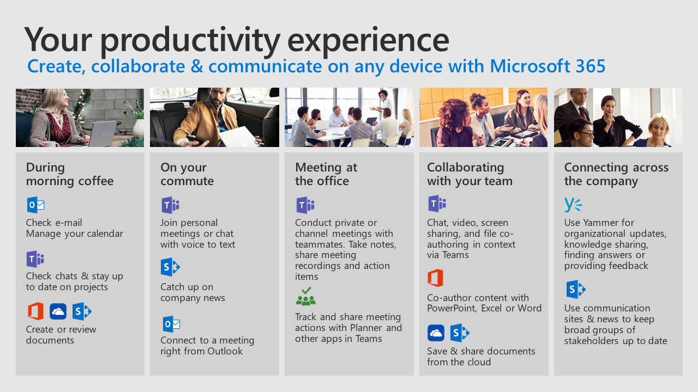

# 與 Office 365 生命週期中的一天Day in the Life with Office 365

使用 Office 365 雲端服務來改善您在任何裝置上的團隊合作。 執行步驟來簡化共同作業、 通訊和內容建立當您移到您的日子。Use Office 365 cloud services to improve your teamwork on any device.  Take steps to streamline your collaboration, communication and content creation as you go through your day.  

若要深入了解提升您的產能與 Office 365 這些常見案例透過 twitter。Follow us through these common scenarios to learn more about improving your productivity with Office 365.

- [在早上咖啡期間During morning coffee](ditl_coffee.md)
- [在您大效益On your commute](ditl_commute.md)
- [Office 的會議Meeting at the office](ditl_meeting.md)
- [與您的小組共同作業Collaborating with your team](ditl_collab.md)
- [跨公司連線Connecting across the company](ditl_connect.md)

> [!TIP]
> 如果您不需要一些您的 Office 365 的功能中我們範例所示的產品說話給您系統管理員可以協助您做好我們服務存取權。If you do not have some of the products shown in our examples in your experience of Office 365 speak to your administrator who can help you get access to our services. 