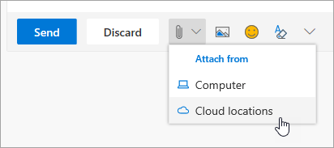

# 與同事合作Collaborating with Colleagues

與同事共同作業的 2:00 PM 和時間。It's 2:00 PM and time to collaborate with colleagues. Office 365 為共同作業提供了一流的機遇，讓小組能夠以多種方式共同運作。Office 365 provides best-in-class opportunities for collaboration, enabling teams to work together in multiple ways. 

## 工具Tools
- Microsoft TeamsMicrosoft Teams
- Office OnlineOffice Online
- OneNoteOneNote
- SharePoint & OneDriveSharePoint & OneDrive
- 
## 與同事合作的檢查清單Checklist for collaborating with colleagues
- 建立或加入 Microsoft 小組以共同作業Create or join a Microsoft Team to collaborate
- 從 OneDrive 建立及共用檔案Create and share files from OneDrive 
- Office 365 中的 CocreateCocreate in Office 365 
- 使用雲端附件Use cloud attachments

## 建立或加入 Microsoft 小組共同合作Create or join a Microsoft Team for collaboration

Microsoft 小組和頻道是人們可透過共用檔案、追蹤小組動作專案等方式共同進行共同作業的地方。Microsoft Teams and channels are places where people can collaborate by sharing files, tracking team action items and much more. 每個 Microsoft 團隊都與 SharePoint 網站、OneNote 筆記本和其他資產整合。Every Microsoft Teams has an integration into a SharePoint site, a OneNote notebook, and other assets. Office 365 的這項服務最適合用於共用專案或結果中經常共同作業的人員。This service of Office 365 is best used for people who work together frequently on shared projects or outcomes. 

## 從您的 OneDrive 共用檔案Share Files from your OneDrive
在商務用 OneDrive 上儲存的檔案，可與任何人共用，不論是 Word 或 Excel 等瀏覽器或 Office 365 桌面應用程式。Files that have been saved on OneDrive for Business can be shared with anyone either from the browser or Office 365 desktop applications like Word or Excel. 您可以使用其名稱、別名或公司電子郵件地址與個人共用。It is possible to share with individuals using their name, alias, or company email address. 

## Office 365 中的共同建立Co-create in Office 365
建立共同作業是指我們同時與同事一起使用相同檔案。Co-creation is when we work simultaneously with colleagues on the same file. 這種情況可在核心 Office 365 應用程式的 web 型版本中，也可以在這些應用程式的桌上出版本中從 Office 2016 向前。This is possible in the web-based versions of the core Office 365 apps and in the desktop versions of those applications from Office 2016 onward.  在相同的檔上節省時間並共同作業，即使您有一位離線狀態，Office 也會為您同步處理這些變更。Save time and work together on the same document and Office will synchronize those changes for you, even if one of you is offline. 

## 使用雲端附件-停止試算表的電子郵件！Use Cloud Attachments - Stop Emailing that Spreadsheet!
在附加至電子郵件時，您必須在檔中搜尋正確版本的情況？How many times have you had to hunt for the right version of a document when it was attached to an email? 現在，您可以在 Office 365 中共用檔案的連結（稱為雲端附件），讓每個人都能編輯相同的版本。Now in Office 365 you can share a link to the file, called a cloud attachment, so that everyone is editing the same version.  您可以選擇傳送連結，以及人員是否可以查看或編輯檔。You can chose to either send a link and whether or not people can view or edit the file. 

