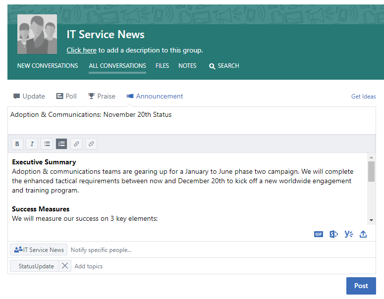
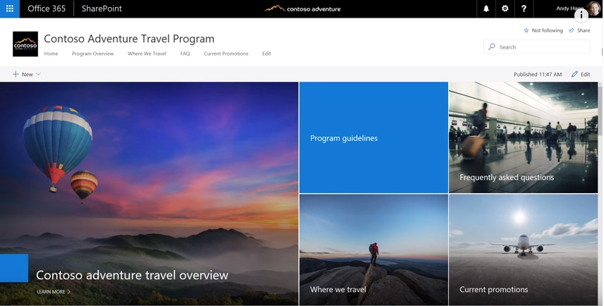
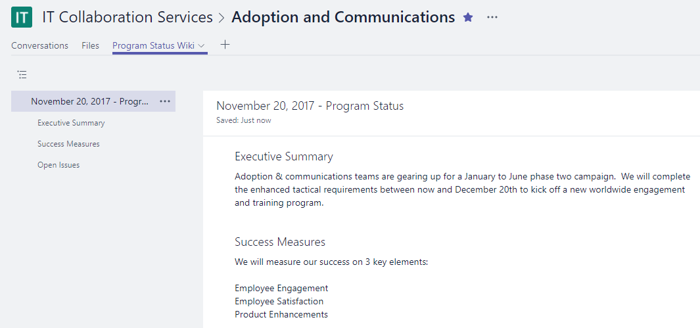

# 跨公司連接

這是一個忙碌的一天，但在離開 office 之前，您想要確定所發生的工作的所有人都對您的工作有任何興趣的通知。 確定所有的專案關係人--在您的小組內外--瞭解您的目標、進度及結果是您所做工作的重要部分。  

## 工具
- SharePoint
- Yammer
- Outlook
- Microsoft Teams 

## 在公司間進行通訊的檢查清單
- 瞭解您的物件及其現有的通訊方法
- 依角色（例如專案專案關係人、小組成員或員工）來設定主要訊息
- 選取彼此進一步補充的通訊工具，例如，在 Yammer 社區上撰寫文章，並透過電子郵件傳送警示 
- 與小組成員 Coauthor 您的資訊
- 發佈您的資訊，並將通知傳送給所有的對等方 
 
## 選取您的通訊方法
請使用下列資訊來決定與您的小組進行通訊的最佳方式。 使用新的技術與傳統的電子郵件宣告進行平衡，同時將人員轉換成新的通訊方法。 採用一致的通訊方式是促進意識和組織變更的有效方式。 

**Yammer**：您可以使用 Yammer 來共用您的更新，以促進跨大量人員的交談。 發佈標準更新或使用宣告功能，確保您的更新副本會移至每個成員的信箱。 

**SharePoint**：如果您想要與您的工作群組以外的人員接觸，請考慮撰寫您的章程的簡短新聞文章，並在您的專案生命週期內保留，以供您在線上 SharePoint 中使用。 使用 SharePoint 小組網站中的新式頁面，或針對較大型的程式，請考慮建立 SharePoint 的通訊網站。 

SharePoint 通訊網站提供視覺及靈活的新聞文章，可讓您將圖像、儀表板及文字嵌入在一起。 然後透過任何瀏覽器或透過 SharePoint 行動應用程式，即可取得資訊。 這段影片提供這些功能強大的網站的快速流覽功能。 若要確認最佳的可見度，請將通訊網站設為您的工作群組的索引標籤，以供 Microsoft 團隊使用。

**Microsoft 小組**：如果這大的人員群組已經是 microsoft 小組中的工作群組的一部分，為何您不會在一般通道中以重要的方式張貼附注，以及更長更新的 Wiki 頁面連結。  Wiki 頁面可由多位人員 coauthored，並在該小組的整個生命週期內保留。 

## 將通訊現代化的秘訣

若 **為您以電子郵件為中心的同事**，請從您的 Yammer 群組或您的 SharePoint 新聞摘要中，訂閱他們的警示。  這樣一來，他們就能在電子郵件中收到通知，告知您已發佈新的資訊，然後再按一下您的來源資訊，而不需要建立個別的電子郵件。  想要取得 snazzy？  使用 Microsoft 流量或 PowerApps 自訂通知。 請考慮讓 brownbag 為這些使用者顯示如何在行動裝置上使用 Microsoft 團隊、SharePoint 或 Yammer。 

**讓人員交談！** 為您的 SharePoint 通訊網站頁面開啟批註，以鼓勵預訂。  如果您使用 Yammer，請務必定期監控您的社區，以瞭解您可以解答的問題。 

**外部共用**：如果您的系統管理員允許在您的 Office 365 實例中，則 Microsoft 團隊、SharePoint 和 Yammer 全都支援外部共用。  您可以使用外部共用，與為合作夥伴、供應商和您的客戶合作的人員共用您的更新。
