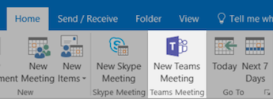

# 辦公室會議

您的會議是 10:00 AM 和時間。 在本節中，我們將告訴您如何讓會議更有效率。  這涉及會議準備和 Office 365 工具的最佳作法。  

## 工具
- Outlook
- Microsoft Teams
- 商務用 Skype
- OneNote

## 會議檢查清單
- 規劃及預訂會議
- 加入會議
- 在會議中呈現資訊
- 在會議中使用 OneNote 以進行共同建立和記事
- 使用會議中的規劃人員追蹤專案的動作專案
- 結束會議
 
## 規劃及預訂會議
您可以執行一些工作，以確保您的會議盡可能生產力：

1. **您是否需要會議？** 請先考慮在聊天中與必要的核准者共用檔案。  
1. **有明確的議程。**  在線上會議邀請的 [附注] 區段中，加入您的會議議程，讓出席者可以做好準備。
1. **錄製會議**  在 Microsoft 小組中使用會議錄製功能，與其他無法參加會議或稍後 transcribe 筆記的人員共用會議。  

現在，您已準備好預訂該會議：使用 Outlook 中的 Microsoft 小組或商務用 Skype 詳細資料來預訂會議。 這樣做可讓您加入來自不同位置的小組成員、記錄會議，以及使用影片 (何時可以) 增強通訊。 

## 加入會議
從任何地方加入。 您可以使用行動裝置從任何地方加入 Microsoft 團隊或商務用 Skype 會議，方法是撥打會議詳細資料中的撥入號碼或使用行動應用程式。 使用行動應用程式時，請關注適用于您或您的國家/地區的行動資料使用量限制。

> [!TIP]
> **使用頭戴式耳機。** 如果您是從書桌上的電腦連線，請使用耳機（而非電腦的內建麥克風和揚聲器），以確保更高的通話品質。

> [!TIP]
> 開啟您的影片！ 當相機可供使用時，有必要使用這些相機，因為面對面通訊會提供在使用語音時可能錯過的非口頭提示。 別擔心，您的頭髮看起來很美觀。 

## 在會議中呈現資訊
從您的裝置共用內容是一種非常好的方式，可聚焦會議，並提供討論的內容。 一般說來，共用您的整個畫面可能是不好的主意。 這表示出現在螢幕上的所有專案都會出現在參加會議的每一個人的畫面上。 只要選取您想要在 Microsoft 小組中共用的內容，就可以避免這樣做。 

## 在會議中使用 OneNote
OneNote 可讓您進行即時共同作業和共同作業，使其成為靈感觸發的理想工具和會議的記事記錄。 只要所有人都可以存取共用 OneNote 所在的位置，您就可以將連結發佈至筆記本並立即開始靈感觸發。

您可以在小組筆記本中為會議筆記建立特定的區段。 您也可以使用 OneNote 中的「會議詳細資料」功能，建立包含會議詳細資料摘要的頁面。

## 在會議中使用 Planner
直接將交辦事項新增至專案的計畫，可讓您在事實後抄錄這些交辦事項。 大型 project 會議中的最佳作法是將人員指派至動作追蹤 & 記事。 這通常與召開會議的個別人員不同。 動作專案提醒會直接傳送給其所指派的個人，但如果專案通過其到期日，便會以提醒形式傳送給該專案。 

## 結束會議
討論議程上的所有專案時，不論時間為何，結束會議。 指派動作專案並將其傳送給所有參與者。 如果您是在 Microsoft 小組中進行共同作業，您可以輕鬆地在適當的通道中共用動作專案。 在會議期間，也可以在 Planner 中輸入或指派動作專案，提供一種快速的方式來追蹤可 [在 Microsoft 小組中存取](https://support.office.com/article/use-planner-in-microsoft-teams-62798a9f-e8f7-4722-a700-27dd28a06ee0)的完成專案。 