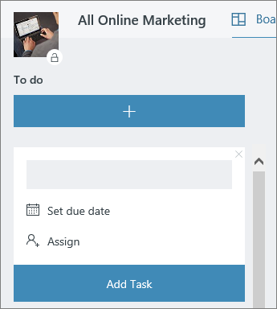

# Office 的會議Meeting at the Office

它是 10:00 AM 和適合開會的時間。此區段中，我們將顯示您如何進行會議提高生產力。 這包括會議準備與 Office 365 工具的最佳作法。It's 10:00 AM and time for your meeting. In this section, we'll show you how to make your meetings more productive.  This involves best practices for meeting preparation and Office 365 tools.  

## 工具Tools
- OutlookOutlook
- Microsoft TeamsMicrosoft Teams
- 商務用 SkypeSkype for Business
- OneNoteOneNote

## 適合開會的檢查清單Checklist for your meeting
- 規劃及書籍會議Plan and book your meeting
- 加入會議Join a meeting
- 在會議中呈現資訊Present information in a meeting
- 在會議中使用 OneNote 共同建立與備忘稿Use OneNote in a meeting for co-creation and notes
- 規劃在會議中使用追蹤該專案的動作項目Use Planner in a meeting to track action items for that project
- 結束會議End a meeting
 
## 規劃及書籍會議Plan and book your meeting
儘可能是您可以執行動作以確定您的會議是以提高工作效率的一些事項：There are a few things you can do to ensure your meeting is as productive as possible:

1. **需要會議？** 請考慮先將交談中的檔案共用時需要核准者。**Do you need a meeting?** Consider sharing a file in chat with the necessary approvers first.  
1. **已清除議程。** 讓出席者可以準備，包括會議議程的附註] 區段中的線上會議邀請。**Have a clear agenda.**  Include your meeting agenda in the notes section of your online meeting invitation so attendees can be prepared.
1. **記錄您的會議** 使用會議中可能不會出席者一起共用會議或更新版本同時備忘稿的 Microsoft 小組錄製的功能。**Record your meeting**  Use meeting recording functions in Microsoft Teams to share the meeting with people who could not attend or to transcribe notes later.  

現在您準備好要預約的會議： 通訊錄與 Microsoft 小組會議或企業版 Skype 詳細說明在 Outlook 中。這麼做讓可讓您包含從不同位置的小組成員、 錄製會議及運用視訊 （如果有的話） 來加強通訊。Now you're ready to book that meeting:  Book the meeting with Microsoft Teams or Skype for Business details in Outlook. Doing so enables you to include team members from different locations, record the meeting and utilize video (when available) to enhance communication. 

## 加入會議Join a meeting
從任何地方加入。有可能從任何地方使用行動裝置，藉由呼叫會議詳細資料中的電話撥入號碼或使用行動應用程式的商務會議加入的 Microsoft 小組或 Skype。當使用行動應用程式，是了解套用至您或國家/地區的行動裝置資料流量限制。Join from anywhere. It is possible to join a Microsoft Teams or Skype for Business meeting from anywhere using a mobile device, either by calling the dial-in number in the meeting details or using the mobile apps. When using the mobile apps, be conscious of mobile data usage limits that apply to you or your country.

> [!TIP]
> **使用耳機。** 如果您在您的服務台連線從您的電腦，使用耳機，而您的電腦內建麥克風和喇叭來確保較佳的通話品質。**Use a headset.** If you are connecting from your computer at your desk, use a headset rather than your computer's built-in microphone and speakers to ensure a better call quality.

> [!TIP]
> 開啟您的視訊 ！照相機為可用、 值得使用這些、 面對面通訊提供只使用語音時可以未接的非語言表達線索。不要擔心、 您線外觀更好。Turn on your video! When cameras are available, it's worth using them, as face-to-face communication provides non-verbal cues that can be missed when just using voice. Don't worry, your hair looks great. 

## 在會議中呈現資訊Present information in a meeting
共用您的裝置的內容是絕佳整個計畫重心在會議，並提供內容的討論。一般會共用您的整個螢幕可以不正確的概念。這表示一切而言螢幕上會出現的所有人參加會議螢幕上。避免這只是選取您要共用的 Microsoft 小組中的內容。Sharing content from your device is a great way to focus your meeting and provide context to the discussion. In general, sharing your entire screen can be a bad idea. It means that everything that comes up on your screen will appear on the screens of everyone attending the meeting. Avoid this by simply selecting the content you want to share in Microsoft Teams. 

## 在會議中使用 OneNoteUse OneNote in a meeting
OneNote 可允許的即時共同作業及共同撰寫的建立，使其成為腦力激盪理想工具然後記下進行會議中。只要每個人都可以存取至 OneNote 共用的所在位置，您可以張貼筆記本的連結並啟動立即腦力激盪。OneNote can allow for real-time collaboration and co-creation, making it an ideal tool for brainstorming and note taking in meetings. As long as everyone has access to the location where the OneNote is shared, you can post a link to the notebook and start brainstorming right away.

您可以建立會議備忘稿小組筆記本中的特定區段。您也可以使用在 OneNote 中的 [會議詳細資料] 功能來建立會議的詳細資料摘要頁面。You can create a specific section for meeting notes in the team notebook. You can also use the "meeting details" functionality in OneNote to create pages with a summary of the details of the meeting.

## 在會議中使用會議規劃Use Planner in a meeting
直接將動作項目新增至您的專案規劃儲存您抄錄其事實之後。它是某人指派給動作追蹤 & 記事的大型專案會議中的最佳作法。這通常是另一個人比個別執行會議。動作項目提醒都會直接傳送至個別對象時，被指派會提醒如果項目通過它的到期日。Directly adding action items into a plan for your project saves you from transcribing them after the fact. It's a best practice in large project meetings to assign someone to action tracking & note taking. This is normally a different person than the individual running the meeting. Action item reminders are sent directly to the individual to whom it is assigned as are reminders if the item passes it's due date. 

## 結束會議End a meeting
當已討論議程上的每個項目時、 結束會議，無論時間。指定並傳送給所有參與者的巨集指令的項目。如果您在 Microsoft 小組共同作業，您可以輕鬆地共用巨集指令中的適當的通道的項目。動作項目也可輸入及規劃中指派提供 fast 方法來完成這個也可以是[Microsoft 小組中存取](https://support.office.com/en-us/article/use-planner-in-microsoft-teams-62798a9f-e8f7-4722-a700-27dd28a06ee0)的追蹤，在會議期間。When everything on the agenda has been discussed, end the meeting, regardless of the time. Assign and send action items to all participants. If you are collaborating in Microsoft Teams, you can easily share action items in the appropriate channel. Action items can also be entered and assigned in Planner during the meeting, providing a fast way to track for completion which can also be [accessed in Microsoft Teams](https://support.office.com/en-us/article/use-planner-in-microsoft-teams-62798a9f-e8f7-4722-a700-27dd28a06ee0). 