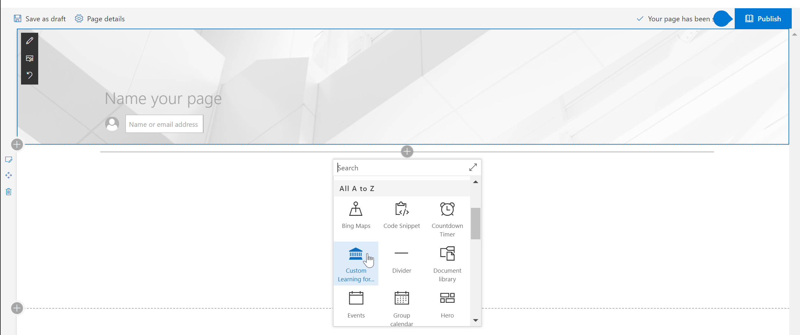

# 網頁組件的預設內容Webpart Default Content

## 播放清單模型The Playlist Model

我們網頁組件會使用熟悉的播放清單模型來組織內容。 此模型會為您的使用者了解簡單並讓您自訂應該您選擇。 自訂不是必要的。 登出方塊經驗提供我們廣泛的參考資料為基礎的有效訓練內容。Our webpart uses a familiar playlist model to organize the content.  This model is simple for your end users to understand and for you to customize should you choose to.  Customization is not required.  Our out of the box experience provides you with effective training content based on our extensive research.

這些播放清單的設計被用來協助組織量身訂作使用者的學習體驗並提供簡易取用播放清單教導這些新功能及提高生產力的行為。Support.Office.com、 的服務內容和資產是簡短悅耳、 了 peppy、 吸引人的影片。These playlists are designed to help organizations tailor the learning experience for users and present them with easy-to-consume playlists to teach them new, and more productive behaviors. The serve content from Support.Office.com, and the assets are short and sweet, with peppy, engaging videos. 

每個並排顯示代表個別精選播放清單或內容的類別。按一下的 [播放清單或類別並排快速會使用者瀏覽至選取的區域。下圖顯示兩個精選的清單下類似 Excel、 的 Microsoft 小組及其他人"取得啟動播放清單 」 與 Office 365 應用程式的類別。Each tile represents either an individual featured playlist or a content category. Clicking on any playlist or category tile quickly navigates the user into the selected area. The graphic below shows both featured lists under "Get Started Playlist" and Office 365 App categories like Excel, Microsoft Teams and others. 

按一下 [Excel] 類別執行個體瀏覽其至播放清單的集合。 可觀賞順序中的內容或選取項目有興趣它們依據使用者的學習需求。Clicking the Excel category for instance navigates them to a collection of playlists.  They can watch content in order or select what interests them based on their learning needs. 

選取 [播放清單檢視Selected playlist view

## 後續步驟Next Steps

- 瀏覽並熟悉現有的內容Browse and familiarize yourself with the existing content
- 繼續進行[自訂播放清單](customplaylists.md)Proceed to [customize playlists](customplaylists.md)